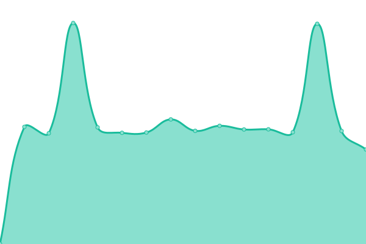

# [📈 Live Status](https://status.opentunnel.net): <!--live status--> **🟧 Partial outage**

This repository contains the open-source uptime monitor and status page for [roosterkid](https://status.opentunnel.net), powered by [Upptime](https://github.com/upptime/upptime).

With [Upptime](https://upptime.js.org), you can get your own unlimited and free uptime monitor and status page, powered entirely by a GitHub repository. We use [Issues](https://github.com/roosterkid/opentunnel-status-server/issues) as incident reports, [Actions](https://github.com/roosterkid/opentunnel-status-server/actions) as uptime monitors, and [Pages](https://status.opentunnel.net) for the status page.

<!--start: status pages-->
<!-- This summary is generated by Upptime (https://github.com/upptime/upptime) -->
<!-- Do not edit this manually, your changes will be overwritten -->
<!-- prettier-ignore -->
| URL | Status | History | Response Time | Uptime |
| --- | ------ | ------- | ------------- | ------ |
|  [OpenTunnel.net Website](https://opentunnel.net/) | 🟩 Up | [open-tunnel-net-website.yml](https://github.com/roosterkid/opentunnel-status-server/commits/HEAD/history/open-tunnel-net-website.yml) | 

 417ms
     
 | 

<a href="https://status.opentunnel.net/history/open-tunnel-net-website">100.00%</a>
    

|  [OpenTunnel.net Community](https://forum.opentunnel.net/) | 🟩 Up | [open-tunnel-net-community.yml](https://github.com/roosterkid/opentunnel-status-server/commits/HEAD/history/open-tunnel-net-community.yml) | 

 504ms
     
 | 

<a href="https://status.opentunnel.net/history/open-tunnel-net-community">100.00%</a>
    

|  [OpenTunnel.net VIP](https://vip.opentunnel.net/) | 🟩 Up | [open-tunnel-net-vip.yml](https://github.com/roosterkid/opentunnel-status-server/commits/HEAD/history/open-tunnel-net-vip.yml) | 

 386ms
     
 | 

<a href="https://status.opentunnel.net/history/open-tunnel-net-vip">100.00%</a>
    

|  [XRAY 🇸🇬 Singapore SGL 1](https://sgx-1.openv2ray.com/) | 🟩 Up | [xray-singapore-sgl-1.yml](https://github.com/roosterkid/opentunnel-status-server/commits/HEAD/history/xray-singapore-sgl-1.yml) | 

 680ms
     
 | 

<a href="https://status.opentunnel.net/history/xray-singapore-sgl-1">99.57%</a>
    

|  [XRAY 🇫🇷 France FRO 1](https://frx-1.openv2ray.com/) | 🟩 Up | [xray-france-fro-1.yml](https://github.com/roosterkid/opentunnel-status-server/commits/HEAD/history/xray-france-fro-1.yml) | 

 436ms
     
 | 

<a href="https://status.opentunnel.net/history/xray-france-fro-1">100.00%</a>
    

|  [XRAY 🇺🇸 United States USF 1](https://usx-1.openv2ray.com/) | 🟩 Up | [xray-united-states-usf-1.yml](https://github.com/roosterkid/opentunnel-status-server/commits/HEAD/history/xray-united-states-usf-1.yml) | 

 395ms
     
 | 

<a href="https://status.opentunnel.net/history/xray-united-states-usf-1">99.34%</a>
    

|  [XRAY 🇰🇷 South Korea KRP 1](https://krx-1.openv2ray.com/) | 🟩 Up | [xray-south-korea-krp-1.yml](https://github.com/roosterkid/opentunnel-status-server/commits/HEAD/history/xray-south-korea-krp-1.yml) | 

 522ms
     
 | 

<a href="https://status.opentunnel.net/history/xray-south-korea-krp-1">95.85%</a>
    

|  [XRAY 🇳🇱 Netherlands NLI 1](https://nlx-1.openv2ray.com/) | 🟩 Up | [xray-netherlands-nli-1.yml](https://github.com/roosterkid/opentunnel-status-server/commits/HEAD/history/xray-netherlands-nli-1.yml) | 

 364ms
     
 | 

<a href="https://status.opentunnel.net/history/xray-netherlands-nli-1">100.00%</a>
    

|  [XRAY 🇮🇩 Indonesia IDA 1](https://idx-1.openv2ray.com/) | 🟩 Up | [xray-indonesia-ida-1.yml](https://github.com/roosterkid/opentunnel-status-server/commits/HEAD/history/xray-indonesia-ida-1.yml) | 

 875ms
     
 | 

<a href="https://status.opentunnel.net/history/xray-indonesia-ida-1">90.95%</a>
    

|  [XRAY 🇯🇵 Japan JPP 1](https://jpx-1.openv2ray.com/) | 🟩 Up | [xray-japan-jpp-1.yml](https://github.com/roosterkid/opentunnel-status-server/commits/HEAD/history/xray-japan-jpp-1.yml) | 

 446ms
     
 | 

<a href="https://status.opentunnel.net/history/xray-japan-jpp-1">100.00%</a>
    

|  [XRAY 🇧🇷 Brazil BRP 1](https://brx-1.openv2ray.com/) | 🟥 Down | [xray-brazil-brp-1.yml](https://github.com/roosterkid/opentunnel-status-server/commits/HEAD/history/xray-brazil-brp-1.yml) | 

 486ms
     
 | 

<a href="https://status.opentunnel.net/history/xray-brazil-brp-1">95.91%</a>
    

|  [XRAY 🇷🇺 Russia RUL 1](https://rux-1.openv2ray.com/) | 🟩 Up | [xray-russia-rul-1.yml](https://github.com/roosterkid/opentunnel-status-server/commits/HEAD/history/xray-russia-rul-1.yml) | 

 605ms
     
 | 

<a href="https://status.opentunnel.net/history/xray-russia-rul-1">100.00%</a>
    

|  [XRAY 🇸🇬 Singapore SGD 1](https://sgx-3.openv2ray.com/) | 🟩 Up | [xray-singapore-sgd-1.yml](https://github.com/roosterkid/opentunnel-status-server/commits/HEAD/history/xray-singapore-sgd-1.yml) | 

 666ms
     
 | 

<a href="https://status.opentunnel.net/history/xray-singapore-sgd-1">98.99%</a>
    

|  [XRAY 🇮🇳 India IND 1](https://inx-1.openv2ray.com/) | 🟩 Up | [xray-india-ind-1.yml](https://github.com/roosterkid/opentunnel-status-server/commits/HEAD/history/xray-india-ind-1.yml) | 

 696ms
     
 | 

<a href="https://status.opentunnel.net/history/xray-india-ind-1">100.00%</a>
    

|  [XRAY 🇩🇪 Germany DEH 1](https://dex-1.openv2ray.com/) | 🟩 Up | [xray-germany-deh-1.yml](https://github.com/roosterkid/opentunnel-status-server/commits/HEAD/history/xray-germany-deh-1.yml) | 

 389ms
     
 | 

<a href="https://status.opentunnel.net/history/xray-germany-deh-1">100.00%</a>
    

|  [XRAY 🇨🇦 Canada CAO 1](https://cax-1.openv2ray.com/) | 🟩 Up | [xray-canada-cao-1.yml](https://github.com/roosterkid/opentunnel-status-server/commits/HEAD/history/xray-canada-cao-1.yml) | 

 208ms
     
 | 

<a href="https://status.opentunnel.net/history/xray-canada-cao-1">99.27%</a>
    

|  [V2RAY 🇸🇬 Singapore SGL 1](https://sgv-1.openv2ray.com/) | 🟩 Up | [v2-ray-singapore-sgl-1.yml](https://github.com/roosterkid/opentunnel-status-server/commits/HEAD/history/v2-ray-singapore-sgl-1.yml) | 

 630ms
     
 | 

<a href="https://status.opentunnel.net/history/v2-ray-singapore-sgl-1">99.73%</a>
    

|  [V2RAY 🇸🇬 Singapore SGP 1](https://sgv-2.openv2ray.com/) | 🟩 Up | [v2-ray-singapore-sgp-1.yml](https://github.com/roosterkid/opentunnel-status-server/commits/HEAD/history/v2-ray-singapore-sgp-1.yml) | 

 657ms
     
 | 

<a href="https://status.opentunnel.net/history/v2-ray-singapore-sgp-1">100.00%</a>
    

|  [V2RAY 🇮🇩 Indonesia IDA 1](https://idv-1.openv2ray.com/) | 🟩 Up | [v2-ray-indonesia-ida-1.yml](https://github.com/roosterkid/opentunnel-status-server/commits/HEAD/history/v2-ray-indonesia-ida-1.yml) | 

 665ms
     
 | 

<a href="https://status.opentunnel.net/history/v2-ray-indonesia-ida-1">100.00%</a>
    

|  [V2RAY 🇺🇸 United States USF 1](https://usv-1.openv2ray.com/) | 🟩 Up | [v2-ray-united-states-usf-1.yml](https://github.com/roosterkid/opentunnel-status-server/commits/HEAD/history/v2-ray-united-states-usf-1.yml) | 

 230ms
     
 | 

<a href="https://status.opentunnel.net/history/v2-ray-united-states-usf-1">100.00%</a>
    

|  [V2RAY 🇸🇬 Singapore SGD 1](https://sgv-3.openv2ray.com/) | 🟩 Up | [v2-ray-singapore-sgd-1.yml](https://github.com/roosterkid/opentunnel-status-server/commits/HEAD/history/v2-ray-singapore-sgd-1.yml) | 

 620ms
     
 | 

<a href="https://status.opentunnel.net/history/v2-ray-singapore-sgd-1">100.00%</a>
    

|  [V2RAY 🇸🇬 Singapore SGO 1](https://sgv-4.openv2ray.com/) | 🟩 Up | [v2-ray-singapore-sgo-1.yml](https://github.com/roosterkid/opentunnel-status-server/commits/HEAD/history/v2-ray-singapore-sgo-1.yml) | 

 405ms
     
 | 

<a href="https://status.opentunnel.net/history/v2-ray-singapore-sgo-1">100.00%</a>
    

|  [V2RAY 🇻🇳 Vietnam VN 1](https://vnv-1.openv2ray.com/) | 🟩 Up | [v2-ray-vietnam-vn-1.yml](https://github.com/roosterkid/opentunnel-status-server/commits/HEAD/history/v2-ray-vietnam-vn-1.yml) | 

 662ms
     
 | 

<a href="https://status.opentunnel.net/history/v2-ray-vietnam-vn-1">99.72%</a>
    

|  [V2RAY 🇸🇬 Singapore SGV 1](https://sgv-5.openv2ray.com/) | 🟩 Up | [v2-ray-singapore-sgv-1.yml](https://github.com/roosterkid/opentunnel-status-server/commits/HEAD/history/v2-ray-singapore-sgv-1.yml) | 

 621ms
     
 | 

<a href="https://status.opentunnel.net/history/v2-ray-singapore-sgv-1">100.00%</a>
    

|  [V2RAY 🇷🇺 Russia RUL 1](https://ruv-1.openv2ray.com/) | 🟩 Up | [v2-ray-russia-rul-1.yml](https://github.com/roosterkid/opentunnel-status-server/commits/HEAD/history/v2-ray-russia-rul-1.yml) | 

 497ms
     
 | 

<a href="https://status.opentunnel.net/history/v2-ray-russia-rul-1">94.51%</a>
    

|  [V2RAY 🇦🇺 Australia AUL 1](https://auv-1.openv2ray.com/) | 🟩 Up | [v2-ray-australia-aul-1.yml](https://github.com/roosterkid/opentunnel-status-server/commits/HEAD/history/v2-ray-australia-aul-1.yml) | 

 562ms
     
 | 

<a href="https://status.opentunnel.net/history/v2-ray-australia-aul-1">99.47%</a>
    

|  [V2RAY 🇺🇸 United States USF 2](https://usv-2.openv2ray.com/) | 🟩 Up | [v2-ray-united-states-usf-2.yml](https://github.com/roosterkid/opentunnel-status-server/commits/HEAD/history/v2-ray-united-states-usf-2.yml) | 

 296ms
     
 | 

<a href="https://status.opentunnel.net/history/v2-ray-united-states-usf-2">100.00%</a>
    

|  [V2RAY 🇺🇸 United States USF 3](https://usv-3.openv2ray.com/) | 🟩 Up | [v2-ray-united-states-usf-3.yml](https://github.com/roosterkid/opentunnel-status-server/commits/HEAD/history/v2-ray-united-states-usf-3.yml) | 

 143ms
     
 | 

<a href="https://status.opentunnel.net/history/v2-ray-united-states-usf-3">100.00%</a>
    

|  [V2RAY 🇮🇩 Indonesia IDG 1](https://idv-2.openv2ray.com/) | 🟩 Up | [v2-ray-indonesia-idg-1.yml](https://github.com/roosterkid/opentunnel-status-server/commits/HEAD/history/v2-ray-indonesia-idg-1.yml) | 

 725ms
     
 | 

<a href="https://status.opentunnel.net/history/v2-ray-indonesia-idg-1">99.80%</a>
    

|  [V2RAY 🇸🇬 Singapore SGO 2](https://sgv-6.openv2ray.com/) | 🟩 Up | [v2-ray-singapore-sgo-2.yml](https://github.com/roosterkid/opentunnel-status-server/commits/HEAD/history/v2-ray-singapore-sgo-2.yml) | 

 717ms
     
 | 

<a href="https://status.opentunnel.net/history/v2-ray-singapore-sgo-2">100.00%</a>
    

|  [V2RAY 🇳🇱 Netherlands NLB 6](https://nlv-6.openv2ray.com/) | 🟩 Up | [v2-ray-netherlands-nlb-6.yml](https://github.com/roosterkid/opentunnel-status-server/commits/HEAD/history/v2-ray-netherlands-nlb-6.yml) | 

 409ms
     
 | 

<a href="https://status.opentunnel.net/history/v2-ray-netherlands-nlb-6">100.00%</a>
    

|  [V2RAY 🇳🇱 Netherlands NLB 1](https://nlv-1.openv2ray.com/) | 🟩 Up | [v2-ray-netherlands-nlb-1.yml](https://github.com/roosterkid/opentunnel-status-server/commits/HEAD/history/v2-ray-netherlands-nlb-1.yml) | 

 369ms
     
 | 

<a href="https://status.opentunnel.net/history/v2-ray-netherlands-nlb-1">100.00%</a>
    

|  [V2RAY 🇩🇪 Germany DEH 1](https://dev-1.openv2ray.com/) | 🟩 Up | [v2-ray-germany-deh-1.yml](https://github.com/roosterkid/opentunnel-status-server/commits/HEAD/history/v2-ray-germany-deh-1.yml) | 

 574ms
     
 | 

<a href="https://status.opentunnel.net/history/v2-ray-germany-deh-1">99.79%</a>
    

|  [V2RAY 🇭🇰 Hong Kong HKM 1](https://hkv-1.openv2ray.com/) | 🟩 Up | [v2-ray-hong-kong-hkm-1.yml](https://github.com/roosterkid/opentunnel-status-server/commits/HEAD/history/v2-ray-hong-kong-hkm-1.yml) | 

 607ms
     
 | 

<a href="https://status.opentunnel.net/history/v2-ray-hong-kong-hkm-1">100.00%</a>
    

|  [V2RAY 🇺🇸 United States USP 4](https://usv-4.openv2ray.com/) | 🟩 Up | [v2-ray-united-states-usp-4.yml](https://github.com/roosterkid/opentunnel-status-server/commits/HEAD/history/v2-ray-united-states-usp-4.yml) | 

 216ms
     
 | 

<a href="https://status.opentunnel.net/history/v2-ray-united-states-usp-4">100.00%</a>
    

|  [V2RAY 🇮🇩 Indonesia IDA 2](https://idv-3.openv2ray.com/) | 🟩 Up | [v2-ray-indonesia-ida-2.yml](https://github.com/roosterkid/opentunnel-status-server/commits/HEAD/history/v2-ray-indonesia-ida-2.yml) | 

 653ms
     
 | 

<a href="https://status.opentunnel.net/history/v2-ray-indonesia-ida-2">100.00%</a>
    

|  [V2RAY 🇻🇳 Vietnam VN 2](https://vnv-2.openv2ray.com/) | 🟩 Up | [v2-ray-vietnam-vn-2.yml](https://github.com/roosterkid/opentunnel-status-server/commits/HEAD/history/v2-ray-vietnam-vn-2.yml) | 

 724ms
     
 | 

<a href="https://status.opentunnel.net/history/v2-ray-vietnam-vn-2">100.00%</a>
    

|  [TROJAN 🇸🇬 Singapore SGV 1](https://sgt-1.opensvr.net/) | 🟩 Up | [trojan-singapore-sgv-1.yml](https://github.com/roosterkid/opentunnel-status-server/commits/HEAD/history/trojan-singapore-sgv-1.yml) | 

 1026ms
     
 | 

<a href="https://status.opentunnel.net/history/trojan-singapore-sgv-1">98.74%</a>
    

|  [TROJAN 🇸🇬 Singapore SGP 1](https://sgt-2.opensvr.net/) | 🟩 Up | [trojan-singapore-sgp-1.yml](https://github.com/roosterkid/opentunnel-status-server/commits/HEAD/history/trojan-singapore-sgp-1.yml) | 

 836ms
     
 | 

<a href="https://status.opentunnel.net/history/trojan-singapore-sgp-1">99.60%</a>
    

|  [TROJAN 🇩🇪 Germany DEH 1](https://det-1.opensvr.net/) | 🟩 Up | [trojan-germany-deh-1.yml](https://github.com/roosterkid/opentunnel-status-server/commits/HEAD/history/trojan-germany-deh-1.yml) | 

 443ms
     
 | 

<a href="https://status.opentunnel.net/history/trojan-germany-deh-1">100.00%</a>
    

|  [TROJAN 🇳🇱 Netherlands NLB 1](https://nlt-1.opensvr.net/) | 🟩 Up | [trojan-netherlands-nlb-1.yml](https://github.com/roosterkid/opentunnel-status-server/commits/HEAD/history/trojan-netherlands-nlb-1.yml) | 

 387ms
     
 | 

<a href="https://status.opentunnel.net/history/trojan-netherlands-nlb-1">100.00%</a>
    

|  [TROJAN 🇯🇵 Japan JPP 1](https://jpt-1.opensvr.net/) | 🟩 Up | [trojan-japan-jpp-1.yml](https://github.com/roosterkid/opentunnel-status-server/commits/HEAD/history/trojan-japan-jpp-1.yml) | 

 481ms
     
 | 

<a href="https://status.opentunnel.net/history/trojan-japan-jpp-1">99.38%</a>
    

|  [TROJAN 🇺🇸 United States USF 1](https://ust-1.opensvr.net/) | 🟩 Up | [trojan-united-states-usf-1.yml](https://github.com/roosterkid/opentunnel-status-server/commits/HEAD/history/trojan-united-states-usf-1.yml) | 

 645ms
     
 | 

<a href="https://status.opentunnel.net/history/trojan-united-states-usf-1">99.84%</a>
    

|  [TROJAN 🇸🇬 Singapore SGA 1](https://sgt-3.opensvr.net/) | 🟩 Up | [trojan-singapore-sga-1.yml](https://github.com/roosterkid/opentunnel-status-server/commits/HEAD/history/trojan-singapore-sga-1.yml) | 

 657ms
     
 | 

<a href="https://status.opentunnel.net/history/trojan-singapore-sga-1">99.58%</a>
    

|  [TROJAN 🇮🇩 Indonesia IDJ 1](https://idt-1.opensvr.net/) | 🟩 Up | [trojan-indonesia-idj-1.yml](https://github.com/roosterkid/opentunnel-status-server/commits/HEAD/history/trojan-indonesia-idj-1.yml) | 

 1304ms
     
 | 

<a href="https://status.opentunnel.net/history/trojan-indonesia-idj-1">93.31%</a>
    

|  [TROJAN 🇭🇰 Hong Kong HKE 1](https://hkt-1.opensvr.net/) | 🟩 Up | [trojan-hong-kong-hke-1.yml](https://github.com/roosterkid/opentunnel-status-server/commits/HEAD/history/trojan-hong-kong-hke-1.yml) | 

 702ms
     
 | 

<a href="https://status.opentunnel.net/history/trojan-hong-kong-hke-1">99.84%</a>
    

|  [TROJAN 🇬🇧 United Kingdom UKO 1](https://ukt-1.opensvr.net/) | 🟥 Down | [trojan-united-kingdom-uko-1.yml](https://github.com/roosterkid/opentunnel-status-server/commits/HEAD/history/trojan-united-kingdom-uko-1.yml) | 

 357ms
     
 | 

<a href="https://status.opentunnel.net/history/trojan-united-kingdom-uko-1">66.94%</a>
    

|  [SSH 🇸🇬 Singapore SGP 1](http://sgs-4.opensvr.net:8080/) | 🟥 Down | [ssh-singapore-sgp-1.yml](https://github.com/roosterkid/opentunnel-status-server/commits/HEAD/history/ssh-singapore-sgp-1.yml) | 

 425ms
     
 | 

<a href="https://status.opentunnel.net/history/ssh-singapore-sgp-1">24.34%</a>
    

|  [SSH 🇺🇸 United States USF 1](http://uss-1.opensvr.net:8080/) | 🟩 Up | [ssh-united-states-usf-1.yml](https://github.com/roosterkid/opentunnel-status-server/commits/HEAD/history/ssh-united-states-usf-1.yml) | 

 130ms
     
 | 

<a href="https://status.opentunnel.net/history/ssh-united-states-usf-1">100.00%</a>
    

|  [SSH 🇸🇬 Singapore SGD 2](http://sgs-1.opensvr.net:8080/) | 🟩 Up | [ssh-singapore-sgd-2.yml](https://github.com/roosterkid/opentunnel-status-server/commits/HEAD/history/ssh-singapore-sgd-2.yml) | 

 414ms
     
 | 

<a href="https://status.opentunnel.net/history/ssh-singapore-sgd-2">100.00%</a>
    

|  [SSH 🇩🇪 Germany DEH 1](http://des-1.opensvr.net:8080/) | 🟩 Up | [ssh-germany-deh-1.yml](https://github.com/roosterkid/opentunnel-status-server/commits/HEAD/history/ssh-germany-deh-1.yml) | 

 253ms
     
 | 

<a href="https://status.opentunnel.net/history/ssh-germany-deh-1">100.00%</a>
    

|  [SSH 🇸🇬 Singapore SGP 2](http://sgs-2.opensvr.net:8080/) | 🟥 Down | [ssh-singapore-sgp-2.yml](https://github.com/roosterkid/opentunnel-status-server/commits/HEAD/history/ssh-singapore-sgp-2.yml) | 

 352ms
     
 | 

<a href="https://status.opentunnel.net/history/ssh-singapore-sgp-2">18.29%</a>
    

|  [SSH 🇮🇩 Indonesia IDJ 1](http://ids-1.opensvr.net:8080/) | 🟩 Up | [ssh-indonesia-idj-1.yml](https://github.com/roosterkid/opentunnel-status-server/commits/HEAD/history/ssh-indonesia-idj-1.yml) | 

 446ms
     
 | 

<a href="https://status.opentunnel.net/history/ssh-indonesia-idj-1">99.73%</a>
    

|  [SSH 🇸🇬 Singapore SGL 1](http://sgs-3.opensvr.net:8080/) | 🟩 Up | [ssh-singapore-sgl-1.yml](https://github.com/roosterkid/opentunnel-status-server/commits/HEAD/history/ssh-singapore-sgl-1.yml) | 

 415ms
     
 | 

<a href="https://status.opentunnel.net/history/ssh-singapore-sgl-1">99.36%</a>
    

|  [SSH 🇫🇷 France FRO 1](http://frs-1.opensvr.net:8080/) | 🟩 Up | [ssh-france-fro-1.yml](https://github.com/roosterkid/opentunnel-status-server/commits/HEAD/history/ssh-france-fro-1.yml) | 

 266ms
     
 | 

<a href="https://status.opentunnel.net/history/ssh-france-fro-1">100.00%</a>
    

|  [SSH 🇨🇦 Canada CAO 1](http://cas-1.opensvr.net:8080/) | 🟩 Up | [ssh-canada-cao-1.yml](https://github.com/roosterkid/opentunnel-status-server/commits/HEAD/history/ssh-canada-cao-1.yml) | 

 119ms
     
 | 

<a href="https://status.opentunnel.net/history/ssh-canada-cao-1">100.00%</a>
    

|  [SSH 🇸🇬 Singapore SGD 1](http://sgs-5.opensvr.net:8080/) | 🟩 Up | [ssh-singapore-sgd-1.yml](https://github.com/roosterkid/opentunnel-status-server/commits/HEAD/history/ssh-singapore-sgd-1.yml) | 

 421ms
     
 | 

<a href="https://status.opentunnel.net/history/ssh-singapore-sgd-1">99.84%</a>
    

|  [SSH 🇮🇩 Indonesia IDA 1](http://ids-2.opensvr.net:8080/) | 🟩 Up | [ssh-indonesia-ida-1.yml](https://github.com/roosterkid/opentunnel-status-server/commits/HEAD/history/ssh-indonesia-ida-1.yml) | 

 452ms
     
 | 

<a href="https://status.opentunnel.net/history/ssh-indonesia-ida-1">99.73%</a>
    

|  [SSH 🇮🇳 India IND 1](http://ins-1.opensvr.net:8080/) | 🟩 Up | [ssh-india-ind-1.yml](https://github.com/roosterkid/opentunnel-status-server/commits/HEAD/history/ssh-india-ind-1.yml) | 

 465ms
     
 | 

<a href="https://status.opentunnel.net/history/ssh-india-ind-1">99.73%</a>
    

|  [SSH 🇺🇸 United States USF 2](http://uss-2.opensvr.net:8080/) | 🟩 Up | [ssh-united-states-usf-2.yml](https://github.com/roosterkid/opentunnel-status-server/commits/HEAD/history/ssh-united-states-usf-2.yml) | 

 89ms
     
 | 

<a href="https://status.opentunnel.net/history/ssh-united-states-usf-2">100.00%</a>
    

|  [SSH 🇩🇪 Germany DEO 2](http://des-2.opensvr.net:8080/) | 🟩 Up | [ssh-germany-deo-2.yml](https://github.com/roosterkid/opentunnel-status-server/commits/HEAD/history/ssh-germany-deo-2.yml) | 

 265ms
     
 | 

<a href="https://status.opentunnel.net/history/ssh-germany-deo-2">99.38%</a>
    

|  [SSH 🇫🇷 France FRO 2](http://frs-2.opensvr.net:8080/) | 🟩 Up | [ssh-france-fro-2.yml](https://github.com/roosterkid/opentunnel-status-server/commits/HEAD/history/ssh-france-fro-2.yml) | 

 285ms
     
 | 

<a href="https://status.opentunnel.net/history/ssh-france-fro-2">99.73%</a>
    

|  [SSH 🇮🇩 Indonesia IDN 1](http://ids-3.opensvr.net:8080/) | 🟩 Up | [ssh-indonesia-idn-1.yml](https://github.com/roosterkid/opentunnel-status-server/commits/HEAD/history/ssh-indonesia-idn-1.yml) | 

 449ms
     
 | 

<a href="https://status.opentunnel.net/history/ssh-indonesia-idn-1">99.57%</a>
    

|  [SSH 🇧🇬 Bulgaria BGI 1](http://bgs-1.opensvr.net:8080/) | 🟩 Up | [ssh-bulgaria-bgi-1.yml](https://github.com/roosterkid/opentunnel-status-server/commits/HEAD/history/ssh-bulgaria-bgi-1.yml) | 

 284ms
     
 | 

<a href="https://status.opentunnel.net/history/ssh-bulgaria-bgi-1">100.00%</a>
    

|  [SSH 🇺🇦 Ukraine UAI 1](http://uas-1.opensvr.net:8080/) | 🟩 Up | [ssh-ukraine-uai-1.yml](https://github.com/roosterkid/opentunnel-status-server/commits/HEAD/history/ssh-ukraine-uai-1.yml) | 

 300ms
     
 | 

<a href="https://status.opentunnel.net/history/ssh-ukraine-uai-1">100.00%</a>
    

|  [SSH 🇮🇩 Indonesia IDA 2](http://ids-4.opensvr.net:8080/) | 🟩 Up | [ssh-indonesia-ida-2.yml](https://github.com/roosterkid/opentunnel-status-server/commits/HEAD/history/ssh-indonesia-ida-2.yml) | 

 439ms
     
 | 

<a href="https://status.opentunnel.net/history/ssh-indonesia-ida-2">99.00%</a>
    

|  [SSH 🇺🇸 United States USF 3](http://uss-3.opensvr.net:8080/) | 🟩 Up | [ssh-united-states-usf-3.yml](https://github.com/roosterkid/opentunnel-status-server/commits/HEAD/history/ssh-united-states-usf-3.yml) | 

 87ms
     
 | 

<a href="https://status.opentunnel.net/history/ssh-united-states-usf-3">99.84%</a>
    

|  [SSH 🇱🇺 Luxembourg LUF 1](http://lus-1.opensvr.net:8080/) | 🟩 Up | [ssh-luxembourg-luf-1.yml](https://github.com/roosterkid/opentunnel-status-server/commits/HEAD/history/ssh-luxembourg-luf-1.yml) | 

 899ms
     
 | 

<a href="https://status.opentunnel.net/history/ssh-luxembourg-luf-1">100.00%</a>
    

|  [SSH 🇬🇧 United Kingdom UKO 1](http://uks-1.opensvr.net:8080/) | 🟩 Up | [ssh-united-kingdom-uko-1.yml](https://github.com/roosterkid/opentunnel-status-server/commits/HEAD/history/ssh-united-kingdom-uko-1.yml) | 

 248ms
     
 | 

<a href="https://status.opentunnel.net/history/ssh-united-kingdom-uko-1">99.73%</a>
    

|  [SSH 🇨🇦 Canada CAO 2](http://cas-2.opensvr.net:8080/) | 🟩 Up | [ssh-canada-cao-2.yml](https://github.com/roosterkid/opentunnel-status-server/commits/HEAD/history/ssh-canada-cao-2.yml) | 

 120ms
     
 | 

<a href="https://status.opentunnel.net/history/ssh-canada-cao-2">99.73%</a>
    

|  [SSH 🇯🇵 Japan JAP 1](http://jas-1.opensvr.net:8080/) | 🟩 Up | [ssh-japan-jap-1.yml](https://github.com/roosterkid/opentunnel-status-server/commits/HEAD/history/ssh-japan-jap-1.yml) | 

 285ms
     
 | 

<a href="https://status.opentunnel.net/history/ssh-japan-jap-1">99.73%</a>
    

|  [SSH 🇸🇬 Singapore XSG 1](http://xs-1.opensvr.net:8080/) | 🟩 Up | [ssh-singapore-xsg-1.yml](https://github.com/roosterkid/opentunnel-status-server/commits/HEAD/history/ssh-singapore-xsg-1.yml) | 

 422ms
     
 | 

<a href="https://status.opentunnel.net/history/ssh-singapore-xsg-1">99.73%</a>
    

|  [SSH 🇸🇬 Singapore XSG 2](http://xs-2.opensvr.net:8080/) | 🟩 Up | [ssh-singapore-xsg-2.yml](https://github.com/roosterkid/opentunnel-status-server/commits/HEAD/history/ssh-singapore-xsg-2.yml) | 

 417ms
     
 | 

<a href="https://status.opentunnel.net/history/ssh-singapore-xsg-2">99.73%</a>
    

|  [SSH 🇨🇭 Switzerland CHI 1](http://chs-1.opensvr.net:8080/) | 🟩 Up | [ssh-switzerland-chi-1.yml](https://github.com/roosterkid/opentunnel-status-server/commits/HEAD/history/ssh-switzerland-chi-1.yml) | 

 270ms
     
 | 

<a href="https://status.opentunnel.net/history/ssh-switzerland-chi-1">100.00%</a>
    

|  [SSH 🇫🇷 France FRO 3](http://frs-3.opensvr.net:8080/) | 🟩 Up | [ssh-france-fro-3.yml](https://github.com/roosterkid/opentunnel-status-server/commits/HEAD/history/ssh-france-fro-3.yml) | 

 245ms
     
 | 

<a href="https://status.opentunnel.net/history/ssh-france-fro-3">99.42%</a>
    

|  [PPTP 🇸🇬 Singapore SGD 1](http://sgp-1.opensvr.net/) | 🟩 Up | [pptp-singapore-sgd-1.yml](https://github.com/roosterkid/opentunnel-status-server/commits/HEAD/history/pptp-singapore-sgd-1.yml) | 

 411ms
     
 | 

<a href="https://status.opentunnel.net/history/pptp-singapore-sgd-1">100.00%</a>
    

|  [PPTP 🇺🇸 United States USF 1](http://usp-1.opensvr.net/) | 🟩 Up | [pptp-united-states-usf-1.yml](https://github.com/roosterkid/opentunnel-status-server/commits/HEAD/history/pptp-united-states-usf-1.yml) | 

 122ms
     
 | 

<a href="https://status.opentunnel.net/history/pptp-united-states-usf-1">100.00%</a>
    

|  [PPTP 🇫🇷 France FRT 1](http://frp-1.opensvr.net/) | 🟩 Up | [pptp-france-frt-1.yml](https://github.com/roosterkid/opentunnel-status-server/commits/HEAD/history/pptp-france-frt-1.yml) | 

 246ms
     
 | 

<a href="https://status.opentunnel.net/history/pptp-france-frt-1">100.00%</a>
    

|  [PPTP 🇮🇩 Indonesia IDJ 1](http://idp-2.opensvr.net/) | 🟩 Up | [pptp-indonesia-idj-1.yml](https://github.com/roosterkid/opentunnel-status-server/commits/HEAD/history/pptp-indonesia-idj-1.yml) | 

 457ms
     
 | 

<a href="https://status.opentunnel.net/history/pptp-indonesia-idj-1">99.73%</a>
    

|  [OVPN 🇸🇬 Singapore SGP 1](http://sgo-1.opensvr.net:8080/) | 🟩 Up | [ovpn-singapore-sgp-1.yml](https://github.com/roosterkid/opentunnel-status-server/commits/HEAD/history/ovpn-singapore-sgp-1.yml) | 

 427ms
     
 | 

<a href="https://status.opentunnel.net/history/ovpn-singapore-sgp-1">95.59%</a>
    

|  [OVPN 🇺🇸 United States USF 1](http://uso-1.opensvr.net:8080/) | 🟩 Up | [ovpn-united-states-usf-1.yml](https://github.com/roosterkid/opentunnel-status-server/commits/HEAD/history/ovpn-united-states-usf-1.yml) | 

 160ms
     
 | 

<a href="https://status.opentunnel.net/history/ovpn-united-states-usf-1">100.00%</a>
    

|  [OVPN 🇸🇬 Singapore SGC 1](http://sgo-2.opensvr.net:8080/) | 🟩 Up | [ovpn-singapore-sgc-1.yml](https://github.com/roosterkid/opentunnel-status-server/commits/HEAD/history/ovpn-singapore-sgc-1.yml) | 

 427ms
     
 | 

<a href="https://status.opentunnel.net/history/ovpn-singapore-sgc-1">100.00%</a>
    

|  [OVPN 🇩🇪 Germany DEH 1](http://deo-1.opensvr.net:8080/) | 🟩 Up | [ovpn-germany-deh-1.yml](https://github.com/roosterkid/opentunnel-status-server/commits/HEAD/history/ovpn-germany-deh-1.yml) | 

 264ms
     
 | 

<a href="https://status.opentunnel.net/history/ovpn-germany-deh-1">94.54%</a>
    

|  [OVPN 🇫🇷 France FRO 1](http://fro-1.opensvr.net:8080/) | 🟩 Up | [ovpn-france-fro-1.yml](https://github.com/roosterkid/opentunnel-status-server/commits/HEAD/history/ovpn-france-fro-1.yml) | 

 308ms
     
 | 

<a href="https://status.opentunnel.net/history/ovpn-france-fro-1">100.00%</a>
    

|  [OVPN 🇺🇸 United States USQ 1](http://uso-2.opensvr.net:8080/) | 🟩 Up | [ovpn-united-states-usq-1.yml](https://github.com/roosterkid/opentunnel-status-server/commits/HEAD/history/ovpn-united-states-usq-1.yml) | 

 99ms
     
 | 

<a href="https://status.opentunnel.net/history/ovpn-united-states-usq-1">100.00%</a>
    

|  [OVPN 🇸🇬 Singapore SGP 2](http://sgo-3.opensvr.net:8080/) | 🟥 Down | [ovpn-singapore-sgp-2.yml](https://github.com/roosterkid/opentunnel-status-server/commits/HEAD/history/ovpn-singapore-sgp-2.yml) | 

 443ms
     
 | 

<a href="https://status.opentunnel.net/history/ovpn-singapore-sgp-2">93.57%</a>
    

|  [OVPN 🇮🇩 Indonesia IDJ 1](http://ido-1.opensvr.net:8080/) | 🟩 Up | [ovpn-indonesia-idj-1.yml](https://github.com/roosterkid/opentunnel-status-server/commits/HEAD/history/ovpn-indonesia-idj-1.yml) | 

 453ms
     
 | 

<a href="https://status.opentunnel.net/history/ovpn-indonesia-idj-1">99.83%</a>
    

<!--end: status pages-->

[**Visit our status website →**](https://status.opentunnel.net)

## 📄 License

- Powered by: [Upptime](https://github.com/upptime/upptime)
- Code: [MIT](./LICENSE) © [roosterkid](https://status.opentunnel.net)
- Data in the `./history` directory: [Open Database License](https://opendatacommons.org/licenses/odbl/1-0/)
