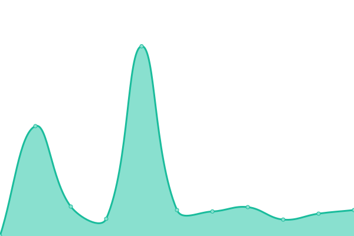

# [📈 Live Status](https://status.opentunnel.net): <!--live status--> **🟧 Partial outage**

This repository contains the open-source uptime monitor and status page for [roosterkid](https://status.opentunnel.net), powered by [Upptime](https://github.com/upptime/upptime).

With [Upptime](https://upptime.js.org), you can get your own unlimited and free uptime monitor and status page, powered entirely by a GitHub repository. We use [Issues](https://github.com/roosterkid/opentunnel-status-server/issues) as incident reports, [Actions](https://github.com/roosterkid/opentunnel-status-server/actions) as uptime monitors, and [Pages](https://status.opentunnel.net) for the status page.

<!--start: status pages-->
<!-- This summary is generated by Upptime (https://github.com/upptime/upptime) -->
<!-- Do not edit this manually, your changes will be overwritten -->
<!-- prettier-ignore -->
| URL | Status | History | Response Time | Uptime |
| --- | ------ | ------- | ------------- | ------ |
|  [OpenTunnel.net Website](https://opentunnel.net/) | 🟩 Up | [open-tunnel-net-website.yml](https://github.com/roosterkid/opentunnel-status-server/commits/HEAD/history/open-tunnel-net-website.yml) | 

 599ms
     
 | 

<a href="https://status.opentunnel.net/history/open-tunnel-net-website">100.00%</a>
    

|  [OpenTunnel.net Community](https://forum.opentunnel.net/) | 🟩 Up | [open-tunnel-net-community.yml](https://github.com/roosterkid/opentunnel-status-server/commits/HEAD/history/open-tunnel-net-community.yml) | 

 528ms
     
 | 

<a href="https://status.opentunnel.net/history/open-tunnel-net-community">100.00%</a>
    

|  [OpenTunnel.net VIP](https://vip.opentunnel.net/) | 🟩 Up | [open-tunnel-net-vip.yml](https://github.com/roosterkid/opentunnel-status-server/commits/HEAD/history/open-tunnel-net-vip.yml) | 

 378ms
     
 | 

<a href="https://status.opentunnel.net/history/open-tunnel-net-vip">100.00%</a>
    

|  [XRAY 🇸🇬 Singapore SGO 1](https://sgx-1.openv2ray.com/) | 🟩 Up | [xray-singapore-sgo-1.yml](https://github.com/roosterkid/opentunnel-status-server/commits/HEAD/history/xray-singapore-sgo-1.yml) | 

 705ms
     
 | 

<a href="https://status.opentunnel.net/history/xray-singapore-sgo-1">93.58%</a>
    

|  [XRAY 🇫🇷 France FRF 1](https://frx-1.openv2ray.com/) | 🟩 Up | [xray-france-frf-1.yml](https://github.com/roosterkid/opentunnel-status-server/commits/HEAD/history/xray-france-frf-1.yml) | 

 399ms
     
 | 

<a href="https://status.opentunnel.net/history/xray-france-frf-1">99.30%</a>
    

|  [XRAY 🇺🇸 United States USF 1](https://usx-1.openv2ray.com/) | 🟩 Up | [xray-united-states-usf-1.yml](https://github.com/roosterkid/opentunnel-status-server/commits/HEAD/history/xray-united-states-usf-1.yml) | 

 185ms
     
 | 

<a href="https://status.opentunnel.net/history/xray-united-states-usf-1">99.57%</a>
    

|  [XRAY 🇳🇱 Netherlands NLI 1](https://nlx-1.openv2ray.com/) | 🟩 Up | [xray-netherlands-nli-1.yml](https://github.com/roosterkid/opentunnel-status-server/commits/HEAD/history/xray-netherlands-nli-1.yml) | 

 479ms
     
 | 

<a href="https://status.opentunnel.net/history/xray-netherlands-nli-1">36.44%</a>
    

|  [XRAY 🇮🇩 Indonesia IDA 1](https://idx-1.openv2ray.com/) | 🟩 Up | [xray-indonesia-ida-1.yml](https://github.com/roosterkid/opentunnel-status-server/commits/HEAD/history/xray-indonesia-ida-1.yml) | 

 1260ms
     
 | 

<a href="https://status.opentunnel.net/history/xray-indonesia-ida-1">99.82%</a>
    

|  [XRAY 🇷🇺 Russia RUL 1](https://rux-1.openv2ray.com/) | 🟩 Up | [xray-russia-rul-1.yml](https://github.com/roosterkid/opentunnel-status-server/commits/HEAD/history/xray-russia-rul-1.yml) | 

 653ms
     
 | 

<a href="https://status.opentunnel.net/history/xray-russia-rul-1">99.82%</a>
    

|  [XRAY 🇸🇬 Singapore SGD 1](https://sgx-3.openv2ray.com/) | 🟩 Up | [xray-singapore-sgd-1.yml](https://github.com/roosterkid/opentunnel-status-server/commits/HEAD/history/xray-singapore-sgd-1.yml) | 

 753ms
     
 | 

<a href="https://status.opentunnel.net/history/xray-singapore-sgd-1">97.07%</a>
    

|  [XRAY 🇩🇪 Germany DEH 1](https://dex-1.openv2ray.com/) | 🟩 Up | [xray-germany-deh-1.yml](https://github.com/roosterkid/opentunnel-status-server/commits/HEAD/history/xray-germany-deh-1.yml) | 

 452ms
     
 | 

<a href="https://status.opentunnel.net/history/xray-germany-deh-1">93.40%</a>
    

|  [XRAY 🇨🇦 Canada CAO 1](https://cax-1.openv2ray.com/) | 🟩 Up | [xray-canada-cao-1.yml](https://github.com/roosterkid/opentunnel-status-server/commits/HEAD/history/xray-canada-cao-1.yml) | 

 575ms
     
 | 

<a href="https://status.opentunnel.net/history/xray-canada-cao-1">88.15%</a>
    

|  [XRAY 🇬🇧 United Kingdom UKO 1](https://ukx-1.openv2ray.com/) | 🟩 Up | [xray-united-kingdom-uko-1.yml](https://github.com/roosterkid/opentunnel-status-server/commits/HEAD/history/xray-united-kingdom-uko-1.yml) | 

 324ms
     
 | 

<a href="https://status.opentunnel.net/history/xray-united-kingdom-uko-1">72.51%</a>
    

|  [WG 🇺🇸 United States USF 1](http://wg-us-1.opensvr.net/) | 🟩 Up | [wg-united-states-usf-1.yml](https://github.com/roosterkid/opentunnel-status-server/commits/HEAD/history/wg-united-states-usf-1.yml) | 

 642ms
     
 | 

<a href="https://status.opentunnel.net/history/wg-united-states-usf-1">95.43%</a>
    

|  [WG 🇮🇩 Indonesia IDA 1](http://wg-id-1.opensvr.net/) | 🟩 Up | [wg-indonesia-ida-1.yml](https://github.com/roosterkid/opentunnel-status-server/commits/HEAD/history/wg-indonesia-ida-1.yml) | 

 510ms
     
 | 

<a href="https://status.opentunnel.net/history/wg-indonesia-ida-1">99.82%</a>
    

|  [WG 🇸🇬 Singapore SGO 1](http://wg-sg-1.opensvr.net/) | 🟩 Up | [wg-singapore-sgo-1.yml](https://github.com/roosterkid/opentunnel-status-server/commits/HEAD/history/wg-singapore-sgo-1.yml) | 

 447ms
     
 | 

<a href="https://status.opentunnel.net/history/wg-singapore-sgo-1">99.82%</a>
    

|  [WG 🇮🇩 Indonesia IDJ 1](http://wg-id-2.opensvr.net/) | 🟩 Up | [wg-indonesia-idj-1.yml](https://github.com/roosterkid/opentunnel-status-server/commits/HEAD/history/wg-indonesia-idj-1.yml) | 

 485ms
     
 | 

<a href="https://status.opentunnel.net/history/wg-indonesia-idj-1">99.70%</a>
    

|  [WG 🇸🇬 Singapore SGC 1](http://wg-sg-2.opensvr.net/) | 🟩 Up | [wg-singapore-sgc-1.yml](https://github.com/roosterkid/opentunnel-status-server/commits/HEAD/history/wg-singapore-sgc-1.yml) | 

 432ms
     
 | 

<a href="https://status.opentunnel.net/history/wg-singapore-sgc-1">99.83%</a>
    

|  [WG 🇫🇷 France FRF 1](http://wg-fr-1.opensvr.net/) | 🟩 Up | [wg-france-frf-1.yml](https://github.com/roosterkid/opentunnel-status-server/commits/HEAD/history/wg-france-frf-1.yml) | 

 236ms
     
 | 

<a href="https://status.opentunnel.net/history/wg-france-frf-1">100.00%</a>
    

|  [V2RAY 🇸🇬 Singapore SGL 1](https://sgv-1.openv2ray.com/) | 🟩 Up | [v2-ray-singapore-sgl-1.yml](https://github.com/roosterkid/opentunnel-status-server/commits/HEAD/history/v2-ray-singapore-sgl-1.yml) | 

 691ms
     
 | 

<a href="https://status.opentunnel.net/history/v2-ray-singapore-sgl-1">99.84%</a>
    

|  [V2RAY 🇸🇬 Singapore SGO 1](https://sgv-2.openv2ray.com/) | 🟩 Up | [v2-ray-singapore-sgo-1.yml](https://github.com/roosterkid/opentunnel-status-server/commits/HEAD/history/v2-ray-singapore-sgo-1.yml) | 

 663ms
     
 | 

<a href="https://status.opentunnel.net/history/v2-ray-singapore-sgo-1">97.65%</a>
    

|  [V2RAY 🇮🇩 Indonesia IDA 1](https://idv-1.openv2ray.com/) | 🟩 Up | [v2-ray-indonesia-ida-1.yml](https://github.com/roosterkid/opentunnel-status-server/commits/HEAD/history/v2-ray-indonesia-ida-1.yml) | 

 835ms
     
 | 

<a href="https://status.opentunnel.net/history/v2-ray-indonesia-ida-1">99.83%</a>
    

|  [V2RAY 🇺🇸 United States USF 1](https://usv-1.openv2ray.com/) | 🟩 Up | [v2-ray-united-states-usf-1.yml](https://github.com/roosterkid/opentunnel-status-server/commits/HEAD/history/v2-ray-united-states-usf-1.yml) | 

 151ms
     
 | 

<a href="https://status.opentunnel.net/history/v2-ray-united-states-usf-1">95.44%</a>
    

|  [V2RAY 🇸🇬 Singapore SGD 1](https://sgv-3.openv2ray.com/) | 🟥 Down | [v2-ray-singapore-sgd-1.yml](https://github.com/roosterkid/opentunnel-status-server/commits/HEAD/history/v2-ray-singapore-sgd-1.yml) | 

 628ms
     
 | 

<a href="https://status.opentunnel.net/history/v2-ray-singapore-sgd-1">75.40%</a>
    

|  [V2RAY 🇸🇬 Singapore SGO 2](https://sgv-4.openv2ray.com/) | 🟩 Up | [v2-ray-singapore-sgo-2.yml](https://github.com/roosterkid/opentunnel-status-server/commits/HEAD/history/v2-ray-singapore-sgo-2.yml) | 

 639ms
     
 | 

<a href="https://status.opentunnel.net/history/v2-ray-singapore-sgo-2">98.56%</a>
    

|  [V2RAY 🇻🇳 Vietnam VN 1](https://vnv-1.openv2ray.com/) | 🟩 Up | [v2-ray-vietnam-vn-1.yml](https://github.com/roosterkid/opentunnel-status-server/commits/HEAD/history/v2-ray-vietnam-vn-1.yml) | 

 728ms
     
 | 

<a href="https://status.opentunnel.net/history/v2-ray-vietnam-vn-1">99.84%</a>
    

|  [V2RAY 🇸🇬 Singapore SGO 4](https://sgv-5.openv2ray.com/) | 🟩 Up | [v2-ray-singapore-sgo-4.yml](https://github.com/roosterkid/opentunnel-status-server/commits/HEAD/history/v2-ray-singapore-sgo-4.yml) | 

 684ms
     
 | 

<a href="https://status.opentunnel.net/history/v2-ray-singapore-sgo-4">100.00%</a>
    

|  [V2RAY 🇷🇺 Russia RUL 1](https://ruv-1.openv2ray.com/) | 🟩 Up | [v2-ray-russia-rul-1.yml](https://github.com/roosterkid/opentunnel-status-server/commits/HEAD/history/v2-ray-russia-rul-1.yml) | 

 475ms
     
 | 

<a href="https://status.opentunnel.net/history/v2-ray-russia-rul-1">100.00%</a>
    

|  [V2RAY 🇦🇺 Australia AUL 1](https://auv-1.openv2ray.com/) | 🟩 Up | [v2-ray-australia-aul-1.yml](https://github.com/roosterkid/opentunnel-status-server/commits/HEAD/history/v2-ray-australia-aul-1.yml) | 

 568ms
     
 | 

<a href="https://status.opentunnel.net/history/v2-ray-australia-aul-1">100.00%</a>
    

|  [V2RAY 🇺🇸 United States USF 2](https://usv-2.openv2ray.com/) | 🟩 Up | [v2-ray-united-states-usf-2.yml](https://github.com/roosterkid/opentunnel-status-server/commits/HEAD/history/v2-ray-united-states-usf-2.yml) | 

 143ms
     
 | 

<a href="https://status.opentunnel.net/history/v2-ray-united-states-usf-2">95.44%</a>
    

|  [V2RAY 🇺🇸 United States USF 3](https://usv-3.openv2ray.com/) | 🟩 Up | [v2-ray-united-states-usf-3.yml](https://github.com/roosterkid/opentunnel-status-server/commits/HEAD/history/v2-ray-united-states-usf-3.yml) | 

 143ms
     
 | 

<a href="https://status.opentunnel.net/history/v2-ray-united-states-usf-3">34.42%</a>
    

|  [V2RAY 🇮🇩 Indonesia IDG 1](https://idv-2.openv2ray.com/) | 🟩 Up | [v2-ray-indonesia-idg-1.yml](https://github.com/roosterkid/opentunnel-status-server/commits/HEAD/history/v2-ray-indonesia-idg-1.yml) | 

 692ms
     
 | 

<a href="https://status.opentunnel.net/history/v2-ray-indonesia-idg-1">99.64%</a>
    

|  [V2RAY 🇸🇬 Singapore SGO 3](https://sgv-6.openv2ray.com/) | 🟩 Up | [v2-ray-singapore-sgo-3.yml](https://github.com/roosterkid/opentunnel-status-server/commits/HEAD/history/v2-ray-singapore-sgo-3.yml) | 

 636ms
     
 | 

<a href="https://status.opentunnel.net/history/v2-ray-singapore-sgo-3">98.57%</a>
    

|  [V2RAY 🇳🇱 Netherlands NLB 6](https://nlv-6.openv2ray.com/) | 🟩 Up | [v2-ray-netherlands-nlb-6.yml](https://github.com/roosterkid/opentunnel-status-server/commits/HEAD/history/v2-ray-netherlands-nlb-6.yml) | 

 364ms
     
 | 

<a href="https://status.opentunnel.net/history/v2-ray-netherlands-nlb-6">100.00%</a>
    

|  [V2RAY 🇳🇱 Netherlands NLB 1](https://nlv-1.openv2ray.com/) | 🟥 Down | [v2-ray-netherlands-nlb-1.yml](https://github.com/roosterkid/opentunnel-status-server/commits/HEAD/history/v2-ray-netherlands-nlb-1.yml) | 

 0ms
     
 | 

<a href="https://status.opentunnel.net/history/v2-ray-netherlands-nlb-1">15.78%</a>
    

|  [V2RAY 🇩🇪 Germany DEH 1](https://dev-1.openv2ray.com/) | 🟩 Up | [v2-ray-germany-deh-1.yml](https://github.com/roosterkid/opentunnel-status-server/commits/HEAD/history/v2-ray-germany-deh-1.yml) | 

 371ms
     
 | 

<a href="https://status.opentunnel.net/history/v2-ray-germany-deh-1">100.00%</a>
    

|  [V2RAY 🇭🇰 Hong Kong HKM 1](https://hkv-1.openv2ray.com/) | 🟩 Up | [v2-ray-hong-kong-hkm-1.yml](https://github.com/roosterkid/opentunnel-status-server/commits/HEAD/history/v2-ray-hong-kong-hkm-1.yml) | 

 815ms
     
 | 

<a href="https://status.opentunnel.net/history/v2-ray-hong-kong-hkm-1">100.00%</a>
    

|  [V2RAY 🇺🇸 United States USO 1](https://usv-4.openv2ray.com/) | 🟩 Up | [v2-ray-united-states-uso-1.yml](https://github.com/roosterkid/opentunnel-status-server/commits/HEAD/history/v2-ray-united-states-uso-1.yml) | 

 632ms
     
 | 

<a href="https://status.opentunnel.net/history/v2-ray-united-states-uso-1">99.08%</a>
    

|  [V2RAY 🇮🇩 Indonesia IDA 2](https://idv-3.openv2ray.com/) | 🟩 Up | [v2-ray-indonesia-ida-2.yml](https://github.com/roosterkid/opentunnel-status-server/commits/HEAD/history/v2-ray-indonesia-ida-2.yml) | 

 819ms
     
 | 

<a href="https://status.opentunnel.net/history/v2-ray-indonesia-ida-2">100.00%</a>
    

|  [V2RAY 🇻🇳 Vietnam VN 2](https://vnv-2.openv2ray.com/) | 🟩 Up | [v2-ray-vietnam-vn-2.yml](https://github.com/roosterkid/opentunnel-status-server/commits/HEAD/history/v2-ray-vietnam-vn-2.yml) | 

 682ms
     
 | 

<a href="https://status.opentunnel.net/history/v2-ray-vietnam-vn-2">100.00%</a>
    

|  [TROJAN 🇸🇬 Singapore SGV 1](https://sgt-1.opensvr.net/) | 🟩 Up | [trojan-singapore-sgv-1.yml](https://github.com/roosterkid/opentunnel-status-server/commits/HEAD/history/trojan-singapore-sgv-1.yml) | 

 771ms
     
 | 

<a href="https://status.opentunnel.net/history/trojan-singapore-sgv-1">71.41%</a>
    

|  [TROJAN 🇸🇬 Singapore SGO 1](https://sgt-2.opensvr.net/) | 🟩 Up | [trojan-singapore-sgo-1.yml](https://github.com/roosterkid/opentunnel-status-server/commits/HEAD/history/trojan-singapore-sgo-1.yml) | 

 1994ms
     
 | 

<a href="https://status.opentunnel.net/history/trojan-singapore-sgo-1">93.70%</a>
    

|  [TROJAN 🇩🇪 Germany DEH 1](https://det-1.opensvr.net/) | 🟩 Up | [trojan-germany-deh-1.yml](https://github.com/roosterkid/opentunnel-status-server/commits/HEAD/history/trojan-germany-deh-1.yml) | 

 1125ms
     
 | 

<a href="https://status.opentunnel.net/history/trojan-germany-deh-1">99.82%</a>
    

|  [TROJAN 🇳🇱 Netherlands NLB 1](https://nlt-1.opensvr.net/) | 🟥 Down | [trojan-netherlands-nlb-1.yml](https://github.com/roosterkid/opentunnel-status-server/commits/HEAD/history/trojan-netherlands-nlb-1.yml) | 

 0ms
     
 | 

<a href="https://status.opentunnel.net/history/trojan-netherlands-nlb-1">0.00%</a>
    

|  [TROJAN 🇨🇦 Canada CAO 1](https://cat-1.opensvr.net/) | 🟩 Up | [trojan-canada-cao-1.yml](https://github.com/roosterkid/opentunnel-status-server/commits/HEAD/history/trojan-canada-cao-1.yml) | 

 1425ms
     
 | 

<a href="https://status.opentunnel.net/history/trojan-canada-cao-1">99.56%</a>
    

|  [TROJAN 🇺🇸 United States USF 1](https://ust-1.opensvr.net/) | 🟩 Up | [trojan-united-states-usf-1.yml](https://github.com/roosterkid/opentunnel-status-server/commits/HEAD/history/trojan-united-states-usf-1.yml) | 

 2411ms
     
 | 

<a href="https://status.opentunnel.net/history/trojan-united-states-usf-1">75.28%</a>
    

|  [TROJAN 🇸🇬 Singapore SGA 1](https://sgt-3.opensvr.net/) | 🟩 Up | [trojan-singapore-sga-1.yml](https://github.com/roosterkid/opentunnel-status-server/commits/HEAD/history/trojan-singapore-sga-1.yml) | 

 699ms
     
 | 

<a href="https://status.opentunnel.net/history/trojan-singapore-sga-1">99.01%</a>
    

|  [TROJAN 🇮🇩 Indonesia IDJ 1](https://idt-1.opensvr.net/) | 🟩 Up | [trojan-indonesia-idj-1.yml](https://github.com/roosterkid/opentunnel-status-server/commits/HEAD/history/trojan-indonesia-idj-1.yml) | 

 2209ms
     
 | 

<a href="https://status.opentunnel.net/history/trojan-indonesia-idj-1">88.94%</a>
    

|  [TROJAN 🇭🇰 Hong Kong HKE 1](https://hkt-1.opensvr.net/) | 🟩 Up | [trojan-hong-kong-hke-1.yml](https://github.com/roosterkid/opentunnel-status-server/commits/HEAD/history/trojan-hong-kong-hke-1.yml) | 

 732ms
     
 | 

<a href="https://status.opentunnel.net/history/trojan-hong-kong-hke-1">98.66%</a>
    

|  [TROJAN 🇬🇧 United Kingdom UKO 1](https://ukt-1.opensvr.net/) | 🟩 Up | [trojan-united-kingdom-uko-1.yml](https://github.com/roosterkid/opentunnel-status-server/commits/HEAD/history/trojan-united-kingdom-uko-1.yml) | 

 501ms
     
 | 

<a href="https://status.opentunnel.net/history/trojan-united-kingdom-uko-1">92.22%</a>
    

|  [TROJAN 🇬🇧 United Kingdom UKO 2](https://ukt-2.opensvr.net/) | 🟩 Up | [trojan-united-kingdom-uko-2.yml](https://github.com/roosterkid/opentunnel-status-server/commits/HEAD/history/trojan-united-kingdom-uko-2.yml) | 

 1001ms
     
 | 

<a href="https://status.opentunnel.net/history/trojan-united-kingdom-uko-2">97.85%</a>
    

|  [TROJAN 🇺🇸 United States USO 1](https://ust-2.opensvr.net/) | 🟩 Up | [trojan-united-states-uso-1.yml](https://github.com/roosterkid/opentunnel-status-server/commits/HEAD/history/trojan-united-states-uso-1.yml) | 

 670ms
     
 | 

<a href="https://status.opentunnel.net/history/trojan-united-states-uso-1">86.71%</a>
    

|  [SSH 🇸🇬 Singapore SGA 1](http://sgs-4.opensvr.net:8080/) | 🟩 Up | [ssh-singapore-sga-1.yml](https://github.com/roosterkid/opentunnel-status-server/commits/HEAD/history/ssh-singapore-sga-1.yml) | 

 420ms
     
 | 

<a href="https://status.opentunnel.net/history/ssh-singapore-sga-1">99.76%</a>
    

|  [SSH 🇺🇸 United States USF 1](http://uss-1.opensvr.net:8080/) | 🟩 Up | [ssh-united-states-usf-1.yml](https://github.com/roosterkid/opentunnel-status-server/commits/HEAD/history/ssh-united-states-usf-1.yml) | 

 102ms
     
 | 

<a href="https://status.opentunnel.net/history/ssh-united-states-usf-1">95.45%</a>
    

|  [SSH 🇸🇬 Singapore SGD 2](http://sgs-1.opensvr.net:8080/) | 🟥 Down | [ssh-singapore-sgd-2.yml](https://github.com/roosterkid/opentunnel-status-server/commits/HEAD/history/ssh-singapore-sgd-2.yml) | 

 426ms
     
 | 

<a href="https://status.opentunnel.net/history/ssh-singapore-sgd-2">75.21%</a>
    

|  [SSH 🇩🇪 Germany DEH 1](http://des-1.opensvr.net:8080/) | 🟩 Up | [ssh-germany-deh-1.yml](https://github.com/roosterkid/opentunnel-status-server/commits/HEAD/history/ssh-germany-deh-1.yml) | 

 246ms
     
 | 

<a href="https://status.opentunnel.net/history/ssh-germany-deh-1">99.82%</a>
    

|  [SSH 🇸🇬 Singapore SGO 1](http://sgs-2.opensvr.net:8080/) | 🟩 Up | [ssh-singapore-sgo-1.yml](https://github.com/roosterkid/opentunnel-status-server/commits/HEAD/history/ssh-singapore-sgo-1.yml) | 

 917ms
     
 | 

<a href="https://status.opentunnel.net/history/ssh-singapore-sgo-1">98.70%</a>
    

|  [SSH 🇮🇩 Indonesia IDJ 1](http://ids-1.opensvr.net:8080/) | 🟩 Up | [ssh-indonesia-idj-1.yml](https://github.com/roosterkid/opentunnel-status-server/commits/HEAD/history/ssh-indonesia-idj-1.yml) | 

 919ms
     
 | 

<a href="https://status.opentunnel.net/history/ssh-indonesia-idj-1">100.00%</a>
    

|  [SSH 🇸🇬 Singapore SGO 2](http://sgs-3.opensvr.net:8080/) | 🟩 Up | [ssh-singapore-sgo-2.yml](https://github.com/roosterkid/opentunnel-status-server/commits/HEAD/history/ssh-singapore-sgo-2.yml) | 

 397ms
     
 | 

<a href="https://status.opentunnel.net/history/ssh-singapore-sgo-2">98.60%</a>
    

|  [SSH 🇫🇷 France FRO 1](http://frs-1.opensvr.net:8080/) | 🟩 Up | [ssh-france-fro-1.yml](https://github.com/roosterkid/opentunnel-status-server/commits/HEAD/history/ssh-france-fro-1.yml) | 

 276ms
     
 | 

<a href="https://status.opentunnel.net/history/ssh-france-fro-1">100.00%</a>
    

|  [SSH 🇨🇦 Canada CAO 1](http://cas-1.opensvr.net:8080/) | 🟩 Up | [ssh-canada-cao-1.yml](https://github.com/roosterkid/opentunnel-status-server/commits/HEAD/history/ssh-canada-cao-1.yml) | 

 117ms
     
 | 

<a href="https://status.opentunnel.net/history/ssh-canada-cao-1">100.00%</a>
    

|  [SSH 🇸🇬 Singapore SGD 1](http://sgs-5.opensvr.net:8080/) | 🟥 Down | [ssh-singapore-sgd-1.yml](https://github.com/roosterkid/opentunnel-status-server/commits/HEAD/history/ssh-singapore-sgd-1.yml) | 

 425ms
     
 | 

<a href="https://status.opentunnel.net/history/ssh-singapore-sgd-1">75.39%</a>
    

|  [SSH 🇮🇩 Indonesia IDA 1](http://ids-2.opensvr.net:8080/) | 🟩 Up | [ssh-indonesia-ida-1.yml](https://github.com/roosterkid/opentunnel-status-server/commits/HEAD/history/ssh-indonesia-ida-1.yml) | 

 479ms
     
 | 

<a href="https://status.opentunnel.net/history/ssh-indonesia-ida-1">100.00%</a>
    

|  [SSH 🇮🇳 India IND 1](http://ins-1.opensvr.net:8080/) | 🟥 Down | [ssh-india-ind-1.yml](https://github.com/roosterkid/opentunnel-status-server/commits/HEAD/history/ssh-india-ind-1.yml) | 

 482ms
     
 | 

<a href="https://status.opentunnel.net/history/ssh-india-ind-1">75.39%</a>
    

|  [SSH 🇺🇸 United States USF 2](http://uss-2.opensvr.net:8080/) | 🟩 Up | [ssh-united-states-usf-2.yml](https://github.com/roosterkid/opentunnel-status-server/commits/HEAD/history/ssh-united-states-usf-2.yml) | 

 105ms
     
 | 

<a href="https://status.opentunnel.net/history/ssh-united-states-usf-2">95.66%</a>
    

|  [SSH 🇩🇪 Germany DEO 2](http://des-2.opensvr.net:8080/) | 🟩 Up | [ssh-germany-deo-2.yml](https://github.com/roosterkid/opentunnel-status-server/commits/HEAD/history/ssh-germany-deo-2.yml) | 

 285ms
     
 | 

<a href="https://status.opentunnel.net/history/ssh-germany-deo-2">100.00%</a>
    

|  [SSH 🇫🇷 France FRO 2](http://frs-2.opensvr.net:8080/) | 🟩 Up | [ssh-france-fro-2.yml](https://github.com/roosterkid/opentunnel-status-server/commits/HEAD/history/ssh-france-fro-2.yml) | 

 256ms
     
 | 

<a href="https://status.opentunnel.net/history/ssh-france-fro-2">100.00%</a>
    

|  [SSH 🇮🇩 Indonesia IDN 1](http://ids-3.opensvr.net:8080/) | 🟩 Up | [ssh-indonesia-idn-1.yml](https://github.com/roosterkid/opentunnel-status-server/commits/HEAD/history/ssh-indonesia-idn-1.yml) | 

 450ms
     
 | 

<a href="https://status.opentunnel.net/history/ssh-indonesia-idn-1">94.98%</a>
    

|  [SSH 🇧🇬 Bulgaria BGI 1](http://bgs-1.opensvr.net:8080/) | 🟩 Up | [ssh-bulgaria-bgi-1.yml](https://github.com/roosterkid/opentunnel-status-server/commits/HEAD/history/ssh-bulgaria-bgi-1.yml) | 

 307ms
     
 | 

<a href="https://status.opentunnel.net/history/ssh-bulgaria-bgi-1">99.85%</a>
    

|  [SSH 🇺🇦 Ukraine UAI 1](http://uas-1.opensvr.net:8080/) | 🟩 Up | [ssh-ukraine-uai-1.yml](https://github.com/roosterkid/opentunnel-status-server/commits/HEAD/history/ssh-ukraine-uai-1.yml) | 

 294ms
     
 | 

<a href="https://status.opentunnel.net/history/ssh-ukraine-uai-1">100.00%</a>
    

|  [SSH 🇮🇩 Indonesia IDA 2](http://ids-4.opensvr.net:8080/) | 🟩 Up | [ssh-indonesia-ida-2.yml](https://github.com/roosterkid/opentunnel-status-server/commits/HEAD/history/ssh-indonesia-ida-2.yml) | 

 460ms
     
 | 

<a href="https://status.opentunnel.net/history/ssh-indonesia-ida-2">97.33%</a>
    

|  [SSH 🇺🇸 United States USF 3](http://uss-3.opensvr.net:8080/) | 🟩 Up | [ssh-united-states-usf-3.yml](https://github.com/roosterkid/opentunnel-status-server/commits/HEAD/history/ssh-united-states-usf-3.yml) | 

 84ms
     
 | 

<a href="https://status.opentunnel.net/history/ssh-united-states-usf-3">62.43%</a>
    

|  [SSH 🇱🇺 Luxembourg LUF 1](http://lus-1.opensvr.net:8080/) | 🟩 Up | [ssh-luxembourg-luf-1.yml](https://github.com/roosterkid/opentunnel-status-server/commits/HEAD/history/ssh-luxembourg-luf-1.yml) | 

 247ms
     
 | 

<a href="https://status.opentunnel.net/history/ssh-luxembourg-luf-1">100.00%</a>
    

|  [SSH 🇬🇧 United Kingdom UKO 1](http://uks-1.opensvr.net:8080/) | 🟩 Up | [ssh-united-kingdom-uko-1.yml](https://github.com/roosterkid/opentunnel-status-server/commits/HEAD/history/ssh-united-kingdom-uko-1.yml) | 

 227ms
     
 | 

<a href="https://status.opentunnel.net/history/ssh-united-kingdom-uko-1">100.00%</a>
    

|  [SSH 🇨🇦 Canada CAO 2](http://cas-2.opensvr.net:8080/) | 🟩 Up | [ssh-canada-cao-2.yml](https://github.com/roosterkid/opentunnel-status-server/commits/HEAD/history/ssh-canada-cao-2.yml) | 

 124ms
     
 | 

<a href="https://status.opentunnel.net/history/ssh-canada-cao-2">100.00%</a>
    

|  [SSH 🇸🇬 Singapore XSG 1](http://xs-1.opensvr.net:8080/) | 🟩 Up | [ssh-singapore-xsg-1.yml](https://github.com/roosterkid/opentunnel-status-server/commits/HEAD/history/ssh-singapore-xsg-1.yml) | 

 416ms
     
 | 

<a href="https://status.opentunnel.net/history/ssh-singapore-xsg-1">42.65%</a>
    

|  [SSH 🇸🇬 Singapore XSG 2](http://xs-2.opensvr.net:8080/) | 🟩 Up | [ssh-singapore-xsg-2.yml](https://github.com/roosterkid/opentunnel-status-server/commits/HEAD/history/ssh-singapore-xsg-2.yml) | 

 422ms
     
 | 

<a href="https://status.opentunnel.net/history/ssh-singapore-xsg-2">100.00%</a>
    

|  [SSH 🇨🇭 Switzerland CHI 1](http://chs-1.opensvr.net:8080/) | 🟩 Up | [ssh-switzerland-chi-1.yml](https://github.com/roosterkid/opentunnel-status-server/commits/HEAD/history/ssh-switzerland-chi-1.yml) | 

 269ms
     
 | 

<a href="https://status.opentunnel.net/history/ssh-switzerland-chi-1">100.00%</a>
    

|  [SSH 🇫🇷 France FRF 1](http://frs-3.opensvr.net:8080/) | 🟩 Up | [ssh-france-frf-1.yml](https://github.com/roosterkid/opentunnel-status-server/commits/HEAD/history/ssh-france-frf-1.yml) | 

 237ms
     
 | 

<a href="https://status.opentunnel.net/history/ssh-france-frf-1">100.00%</a>
    

|  [SSH 🇺🇸 United States USO 1](http://uss-4.opensvr.net:8080/) | 🟩 Up | [ssh-united-states-uso-1.yml](https://github.com/roosterkid/opentunnel-status-server/commits/HEAD/history/ssh-united-states-uso-1.yml) | 

 112ms
     
 | 

<a href="https://status.opentunnel.net/history/ssh-united-states-uso-1">100.00%</a>
    

|  [SSH 🇬🇧 United Kingdom UKO 2](http://uks-2.opensvr.net:8080/) | 🟩 Up | [ssh-united-kingdom-uko-2.yml](https://github.com/roosterkid/opentunnel-status-server/commits/HEAD/history/ssh-united-kingdom-uko-2.yml) | 

 246ms
     
 | 

<a href="https://status.opentunnel.net/history/ssh-united-kingdom-uko-2">99.82%</a>
    

|  [SSH 🇦🇺 Australia AUO 1](http://aus-1.opensvr.net:8080/) | 🟩 Up | [ssh-australia-auo-1.yml](https://github.com/roosterkid/opentunnel-status-server/commits/HEAD/history/ssh-australia-auo-1.yml) | 

 368ms
     
 | 

<a href="https://status.opentunnel.net/history/ssh-australia-auo-1">100.00%</a>
    

|  [PPTP 🇸🇬 Singapore SGD 1](http://sgp-1.opensvr.net/) | 🟩 Up | [pptp-singapore-sgd-1.yml](https://github.com/roosterkid/opentunnel-status-server/commits/HEAD/history/pptp-singapore-sgd-1.yml) | 

 419ms
     
 | 

<a href="https://status.opentunnel.net/history/pptp-singapore-sgd-1">100.00%</a>
    

|  [PPTP 🇺🇸 United States USF 1](http://usp-1.opensvr.net/) | 🟩 Up | [pptp-united-states-usf-1.yml](https://github.com/roosterkid/opentunnel-status-server/commits/HEAD/history/pptp-united-states-usf-1.yml) | 

 104ms
     
 | 

<a href="https://status.opentunnel.net/history/pptp-united-states-usf-1">95.46%</a>
    

|  [PPTP 🇫🇷 France FRT 1](http://frp-1.opensvr.net/) | 🟩 Up | [pptp-france-frt-1.yml](https://github.com/roosterkid/opentunnel-status-server/commits/HEAD/history/pptp-france-frt-1.yml) | 

 270ms
     
 | 

<a href="https://status.opentunnel.net/history/pptp-france-frt-1">100.00%</a>
    

|  [PPTP 🇮🇩 Indonesia IDJ 1](http://idp-2.opensvr.net/) | 🟩 Up | [pptp-indonesia-idj-1.yml](https://github.com/roosterkid/opentunnel-status-server/commits/HEAD/history/pptp-indonesia-idj-1.yml) | 

 443ms
     
 | 

<a href="https://status.opentunnel.net/history/pptp-indonesia-idj-1">100.00%</a>
    

|  [PPTP 🇬🇧 United Kingdom UKO 1](http://ukp-1.opensvr.net/) | 🟩 Up | [pptp-united-kingdom-uko-1.yml](https://github.com/roosterkid/opentunnel-status-server/commits/HEAD/history/pptp-united-kingdom-uko-1.yml) | 

 249ms
     
 | 

<a href="https://status.opentunnel.net/history/pptp-united-kingdom-uko-1">100.00%</a>
    

|  [PPTP 🇨🇦 Canada CAO 1](http://cap-1.opensvr.net/) | 🟩 Up | [pptp-canada-cao-1.yml](https://github.com/roosterkid/opentunnel-status-server/commits/HEAD/history/pptp-canada-cao-1.yml) | 

 118ms
     
 | 

<a href="https://status.opentunnel.net/history/pptp-canada-cao-1">100.00%</a>
    

|  [PPTP 🇺🇸 United States USO 1](http://usp-2.opensvr.net/) | 🟩 Up | [pptp-united-states-uso-1.yml](https://github.com/roosterkid/opentunnel-status-server/commits/HEAD/history/pptp-united-states-uso-1.yml) | 

 105ms
     
 | 

<a href="https://status.opentunnel.net/history/pptp-united-states-uso-1">100.00%</a>
    

|  [OVPN 🇸🇬 Singapore SGA 1](http://sgo-1.opensvr.net:8080/) | 🟩 Up | [ovpn-singapore-sga-1.yml](https://github.com/roosterkid/opentunnel-status-server/commits/HEAD/history/ovpn-singapore-sga-1.yml) | 

 419ms
     
 | 

<a href="https://status.opentunnel.net/history/ovpn-singapore-sga-1">100.00%</a>
    

|  [OVPN 🇺🇸 United States USF 1](http://uso-1.opensvr.net:8080/) | 🟩 Up | [ovpn-united-states-usf-1.yml](https://github.com/roosterkid/opentunnel-status-server/commits/HEAD/history/ovpn-united-states-usf-1.yml) | 

 107ms
     
 | 

<a href="https://status.opentunnel.net/history/ovpn-united-states-usf-1">95.46%</a>
    

|  [OVPN 🇸🇬 Singapore SGC 1](http://sgo-2.opensvr.net:8080/) | 🟥 Down | [ovpn-singapore-sgc-1.yml](https://github.com/roosterkid/opentunnel-status-server/commits/HEAD/history/ovpn-singapore-sgc-1.yml) | 

 0ms
     
 | 

<a href="https://status.opentunnel.net/history/ovpn-singapore-sgc-1">0.00%</a>
    

|  [OVPN 🇩🇪 Germany DEH 1](http://deo-1.opensvr.net:8080/) | 🟩 Up | [ovpn-germany-deh-1.yml](https://github.com/roosterkid/opentunnel-status-server/commits/HEAD/history/ovpn-germany-deh-1.yml) | 

 240ms
     
 | 

<a href="https://status.opentunnel.net/history/ovpn-germany-deh-1">100.00%</a>
    

|  [OVPN 🇬🇧 United Kingdom UKO 1](http://uko-1.opensvr.net:8080/) | 🟩 Up | [ovpn-united-kingdom-uko-1.yml](https://github.com/roosterkid/opentunnel-status-server/commits/HEAD/history/ovpn-united-kingdom-uko-1.yml) | 

 231ms
     
 | 

<a href="https://status.opentunnel.net/history/ovpn-united-kingdom-uko-1">100.00%</a>
    

|  [OVPN 🇫🇷 France FRO 1](http://fro-1.opensvr.net:8080/) | 🟩 Up | [ovpn-france-fro-1.yml](https://github.com/roosterkid/opentunnel-status-server/commits/HEAD/history/ovpn-france-fro-1.yml) | 

 255ms
     
 | 

<a href="https://status.opentunnel.net/history/ovpn-france-fro-1">100.00%</a>
    

|  [OVPN 🇺🇸 United States USQ 1](http://uso-2.opensvr.net:8080/) | 🟩 Up | [ovpn-united-states-usq-1.yml](https://github.com/roosterkid/opentunnel-status-server/commits/HEAD/history/ovpn-united-states-usq-1.yml) | 

 1072ms
     
 | 

<a href="https://status.opentunnel.net/history/ovpn-united-states-usq-1">99.81%</a>
    

|  [OVPN 🇸🇬 Singapore SGA 2](http://sgo-3.opensvr.net:8080/) | 🟩 Up | [ovpn-singapore-sga-2.yml](https://github.com/roosterkid/opentunnel-status-server/commits/HEAD/history/ovpn-singapore-sga-2.yml) | 

 416ms
     
 | 

<a href="https://status.opentunnel.net/history/ovpn-singapore-sga-2">100.00%</a>
    

|  [OVPN 🇮🇩 Indonesia IDJ 1](http://ido-1.opensvr.net:8080/) | 🟩 Up | [ovpn-indonesia-idj-1.yml](https://github.com/roosterkid/opentunnel-status-server/commits/HEAD/history/ovpn-indonesia-idj-1.yml) | 

 439ms
     
 | 

<a href="https://status.opentunnel.net/history/ovpn-indonesia-idj-1">61.68%</a>
    

|  [OVPN 🇨🇦 Canada CAO 1](http://cao-1.opensvr.net:8080/) | 🟩 Up | [ovpn-canada-cao-1.yml](https://github.com/roosterkid/opentunnel-status-server/commits/HEAD/history/ovpn-canada-cao-1.yml) | 

 114ms
     
 | 

<a href="https://status.opentunnel.net/history/ovpn-canada-cao-1">100.00%</a>
    

<!--end: status pages-->

[**Visit our status website →**](https://status.opentunnel.net)

## 📄 License

- Powered by: [Upptime](https://github.com/upptime/upptime)
- Code: [MIT](./LICENSE) © [roosterkid](https://status.opentunnel.net)
- Data in the `./history` directory: [Open Database License](https://opendatacommons.org/licenses/odbl/1-0/)
