# [📈 Live Status](https://status.opentunnel.net): <!--live status--> **🟧 Partial outage**

This repository contains the open-source uptime monitor and status page for [roosterkid](https://status.opentunnel.net), powered by [Upptime](https://github.com/upptime/upptime).

With [Upptime](https://upptime.js.org), you can get your own unlimited and free uptime monitor and status page, powered entirely by a GitHub repository. We use [Issues](https://github.com/roosterkid/opentunnel-status-server/issues) as incident reports, [Actions](https://github.com/roosterkid/opentunnel-status-server/actions) as uptime monitors, and [Pages](https://status.opentunnel.net) for the status page.

<!--start: status pages-->
<!-- This summary is generated by Upptime (https://github.com/upptime/upptime) -->
<!-- Do not edit this manually, your changes will be overwritten -->
<!-- prettier-ignore -->
| URL | Status | History | Response Time | Uptime |
| --- | ------ | ------- | ------------- | ------ |
|  [OpenTunnel.net Website](https://opentunnel.net/) | 🟩 Up | [open-tunnel-net-website.yml](https://github.com/roosterkid/opentunnel-status-server/commits/HEAD/history/open-tunnel-net-website.yml) | 

 474ms
     
 | 

<a href="https://status.opentunnel.net/history/open-tunnel-net-website">100.00%</a>
    

|  [OpenTunnel.net Community](https://forum.opentunnel.net/) | 🟩 Up | [open-tunnel-net-community.yml](https://github.com/roosterkid/opentunnel-status-server/commits/HEAD/history/open-tunnel-net-community.yml) | 

 430ms
     
 | 

<a href="https://status.opentunnel.net/history/open-tunnel-net-community">99.81%</a>
    

|  [OpenTunnel.net VIP Panel](https://client.opentunnel.net/) | 🟩 Up | [open-tunnel-net-vip-panel.yml](https://github.com/roosterkid/opentunnel-status-server/commits/HEAD/history/open-tunnel-net-vip-panel.yml) | 

 350ms
     
 | 

<a href="https://status.opentunnel.net/history/open-tunnel-net-vip-panel">100.00%</a>
    

|  [XRAY 🇫🇷 France FRF 1](https://frx-1.openv2ray.com/) | 🟩 Up | [xray-france-frf-1.yml](https://github.com/roosterkid/opentunnel-status-server/commits/HEAD/history/xray-france-frf-1.yml) | 

 373ms
     
 | 

<a href="https://status.opentunnel.net/history/xray-france-frf-1">100.00%</a>
    

|  [XRAY 🇺🇸 United States USF 1](https://usx-1.openv2ray.com/) | 🟩 Up | [xray-united-states-usf-1.yml](https://github.com/roosterkid/opentunnel-status-server/commits/HEAD/history/xray-united-states-usf-1.yml) | 

 202ms
     
 | 

<a href="https://status.opentunnel.net/history/xray-united-states-usf-1">100.00%</a>
    

|  [XRAY 🇮🇩 Indonesia IDA 1](https://idx-1.openv2ray.com/) | 🟩 Up | [xray-indonesia-ida-1.yml](https://github.com/roosterkid/opentunnel-status-server/commits/HEAD/history/xray-indonesia-ida-1.yml) | 

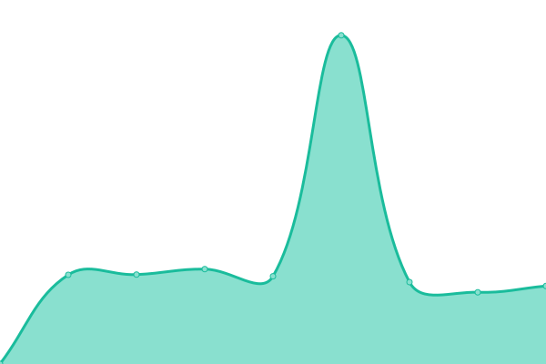 930ms
     
 | 

<a href="https://status.opentunnel.net/history/xray-indonesia-ida-1">30.23%</a>
    

|  [XRAY 🇸🇬 Singapore SGO 2](https://sgx-3.openv2ray.com/) | 🟩 Up | [xray-singapore-sgo-2.yml](https://github.com/roosterkid/opentunnel-status-server/commits/HEAD/history/xray-singapore-sgo-2.yml) | 

 526ms
     
 | 

<a href="https://status.opentunnel.net/history/xray-singapore-sgo-2">98.63%</a>
    

|  [XRAY 🇩🇪 Germany DEH 1](https://dex-1.openv2ray.com/) | 🟩 Up | [xray-germany-deh-1.yml](https://github.com/roosterkid/opentunnel-status-server/commits/HEAD/history/xray-germany-deh-1.yml) | 

 388ms
     
 | 

<a href="https://status.opentunnel.net/history/xray-germany-deh-1">100.00%</a>
    

|  [XRAY 🇨🇦 Canada CAO 1](https://cax-1.openv2ray.com/) | 🟩 Up | [xray-canada-cao-1.yml](https://github.com/roosterkid/opentunnel-status-server/commits/HEAD/history/xray-canada-cao-1.yml) | 

 140ms
     
 | 

<a href="https://status.opentunnel.net/history/xray-canada-cao-1">99.83%</a>
    

|  [XRAY 🇬🇧 United Kingdom UKO 1](https://ukx-1.openv2ray.com/) | 🟩 Up | [xray-united-kingdom-uko-1.yml](https://github.com/roosterkid/opentunnel-status-server/commits/HEAD/history/xray-united-kingdom-uko-1.yml) | 

 1009ms
     
 | 

<a href="https://status.opentunnel.net/history/xray-united-kingdom-uko-1">98.40%</a>
    

|  [WG 🇺🇸 United States USF 1](http://wg-us-1.optnl.com/) | 🟩 Up | [wg-united-states-usf-1.yml](https://github.com/roosterkid/opentunnel-status-server/commits/HEAD/history/wg-united-states-usf-1.yml) | 

 178ms
     
 | 

<a href="https://status.opentunnel.net/history/wg-united-states-usf-1">100.00%</a>
    

|  [WG 🇸🇬 Singapore SGC 1](http://wg-sg-2.optnl.com/) | 🟩 Up | [wg-singapore-sgc-1.yml](https://github.com/roosterkid/opentunnel-status-server/commits/HEAD/history/wg-singapore-sgc-1.yml) | 

 465ms
     
 | 

<a href="https://status.opentunnel.net/history/wg-singapore-sgc-1">100.00%</a>
    

|  [WG 🇫🇷 France FRF 1](http://wg-fr-1.optnl.com/) | 🟩 Up | [wg-france-frf-1.yml](https://github.com/roosterkid/opentunnel-status-server/commits/HEAD/history/wg-france-frf-1.yml) | 

 299ms
     
 | 

<a href="https://status.opentunnel.net/history/wg-france-frf-1">100.00%</a>
    

|  [V2RAY 🇸🇬 Singapore SGF 1](https://sgv-1.openv2ray.com/) | 🟩 Up | [v2-ray-singapore-sgf-1.yml](https://github.com/roosterkid/opentunnel-status-server/commits/HEAD/history/v2-ray-singapore-sgf-1.yml) | 

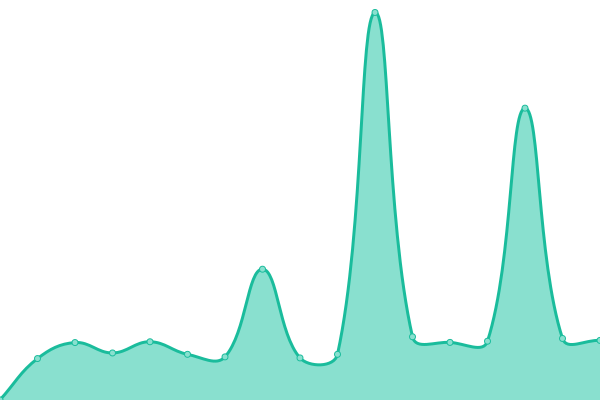 655ms
     
 | 

<a href="https://status.opentunnel.net/history/v2-ray-singapore-sgf-1">87.71%</a>
    

|  [V2RAY 🇸🇬 Singapore SGF 2](https://sgv-2.openv2ray.com/) | 🟩 Up | [v2-ray-singapore-sgf-2.yml](https://github.com/roosterkid/opentunnel-status-server/commits/HEAD/history/v2-ray-singapore-sgf-2.yml) | 

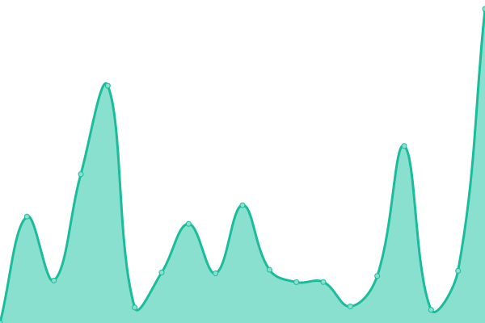 657ms
     
 | 

<a href="https://status.opentunnel.net/history/v2-ray-singapore-sgf-2">99.14%</a>
    

|  [V2RAY 🇺🇸 United States USF 1](https://usv-1.openv2ray.com/) | 🟩 Up | [v2-ray-united-states-usf-1.yml](https://github.com/roosterkid/opentunnel-status-server/commits/HEAD/history/v2-ray-united-states-usf-1.yml) | 

 155ms
     
 | 

<a href="https://status.opentunnel.net/history/v2-ray-united-states-usf-1">100.00%</a>
    

|  [V2RAY 🇸🇬 Singapore SGF 3](https://sgv-3.openv2ray.com/) | 🟩 Up | [v2-ray-singapore-sgf-3.yml](https://github.com/roosterkid/opentunnel-status-server/commits/HEAD/history/v2-ray-singapore-sgf-3.yml) | 

 750ms
     
 | 

<a href="https://status.opentunnel.net/history/v2-ray-singapore-sgf-3">94.16%</a>
    

|  [V2RAY 🇸🇬 Singapore SGF 4](https://sgv-4.openv2ray.com/) | 🟩 Up | [v2-ray-singapore-sgf-4.yml](https://github.com/roosterkid/opentunnel-status-server/commits/HEAD/history/v2-ray-singapore-sgf-4.yml) | 

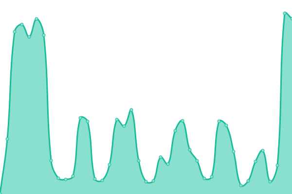 1068ms
     
 | 

<a href="https://status.opentunnel.net/history/v2-ray-singapore-sgf-4">85.72%</a>
    

|  [V2RAY 🇦🇺 Australia AUO 1](https://auv-1.openv2ray.com/) | 🟩 Up | [v2-ray-australia-auo-1.yml](https://github.com/roosterkid/opentunnel-status-server/commits/HEAD/history/v2-ray-australia-auo-1.yml) | 

 571ms
     
 | 

<a href="https://status.opentunnel.net/history/v2-ray-australia-auo-1">100.00%</a>
    

|  [V2RAY 🇺🇸 United States USF 2](https://usv-2.openv2ray.com/) | 🟩 Up | [v2-ray-united-states-usf-2.yml](https://github.com/roosterkid/opentunnel-status-server/commits/HEAD/history/v2-ray-united-states-usf-2.yml) | 

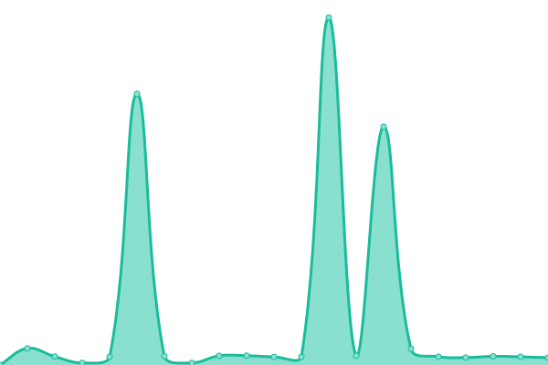 154ms
     
 | 

<a href="https://status.opentunnel.net/history/v2-ray-united-states-usf-2">100.00%</a>
    

|  [V2RAY 🇺🇸 United States USF 3](https://usv-3.openv2ray.com/) | 🟩 Up | [v2-ray-united-states-usf-3.yml](https://github.com/roosterkid/opentunnel-status-server/commits/HEAD/history/v2-ray-united-states-usf-3.yml) | 

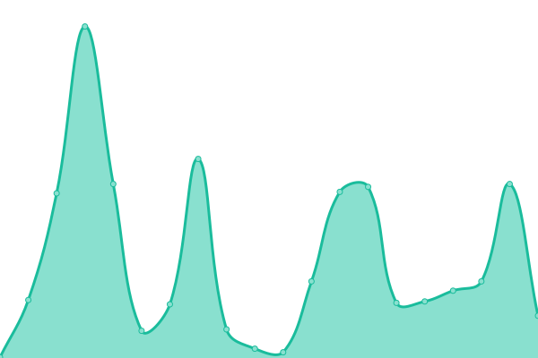 146ms
     
 | 

<a href="https://status.opentunnel.net/history/v2-ray-united-states-usf-3">99.82%</a>
    

|  [V2RAY 🇳🇱 Netherlands NLI 1](https://nlv-6.openv2ray.com/) | 🟩 Up | [v2-ray-netherlands-nli-1.yml](https://github.com/roosterkid/opentunnel-status-server/commits/HEAD/history/v2-ray-netherlands-nli-1.yml) | 

 334ms
     
 | 

<a href="https://status.opentunnel.net/history/v2-ray-netherlands-nli-1">99.81%</a>
    

|  [V2RAY 🇳🇱 Netherlands NLI 2](https://nlv-1.openv2ray.com/) | 🟩 Up | [v2-ray-netherlands-nli-2.yml](https://github.com/roosterkid/opentunnel-status-server/commits/HEAD/history/v2-ray-netherlands-nli-2.yml) | 

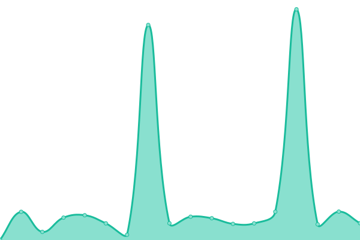 363ms
     
 | 

<a href="https://status.opentunnel.net/history/v2-ray-netherlands-nli-2">30.61%</a>
    

|  [V2RAY 🇩🇪 Germany DEH 1](https://dev-1.openv2ray.com/) | 🟩 Up | [v2-ray-germany-deh-1.yml](https://github.com/roosterkid/opentunnel-status-server/commits/HEAD/history/v2-ray-germany-deh-1.yml) | 

 395ms
     
 | 

<a href="https://status.opentunnel.net/history/v2-ray-germany-deh-1">30.61%</a>
    

|  [V2RAY 🇭🇰 Hong Kong HKM 1](https://hkv-1.openv2ray.com/) | 🟩 Up | [v2-ray-hong-kong-hkm-1.yml](https://github.com/roosterkid/opentunnel-status-server/commits/HEAD/history/v2-ray-hong-kong-hkm-1.yml) | 

 599ms
     
 | 

<a href="https://status.opentunnel.net/history/v2-ray-hong-kong-hkm-1">99.81%</a>
    

|  [V2RAY 🇺🇸 United States USO 1](https://usv-4.openv2ray.com/) | 🟩 Up | [v2-ray-united-states-uso-1.yml](https://github.com/roosterkid/opentunnel-status-server/commits/HEAD/history/v2-ray-united-states-uso-1.yml) | 

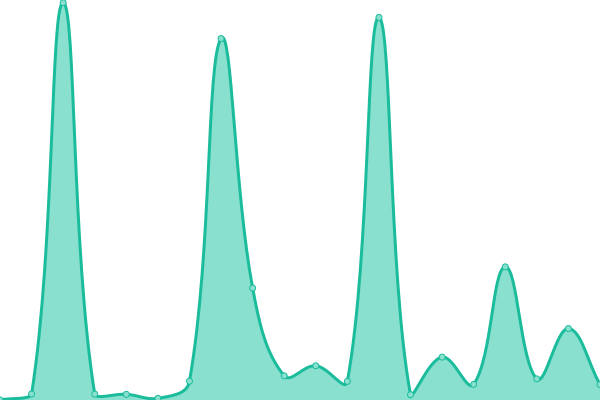 164ms
     
 | 

<a href="https://status.opentunnel.net/history/v2-ray-united-states-uso-1">98.98%</a>
    

|  [V2RAY 🇮🇩 Indonesia IDA 2](https://idv-3.openv2ray.com/) | 🟥 Down | [v2-ray-indonesia-ida-2.yml](https://github.com/roosterkid/opentunnel-status-server/commits/HEAD/history/v2-ray-indonesia-ida-2.yml) | 

 618ms
     
 | 

<a href="https://status.opentunnel.net/history/v2-ray-indonesia-ida-2">29.60%</a>
    

|  [V2RAY 🇫🇷 France FR 1](https://frv-1.openv2ray.com/) | 🟩 Up | [v2-ray-france-fr-1.yml](https://github.com/roosterkid/opentunnel-status-server/commits/HEAD/history/v2-ray-france-fr-1.yml) | 

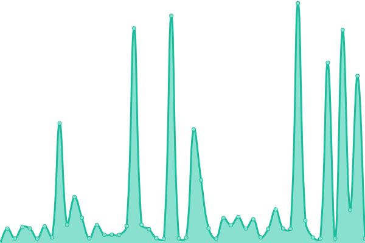 691ms
     
 | 

<a href="https://status.opentunnel.net/history/v2-ray-france-fr-1">98.69%</a>
    

|  [TROJAN 🇸🇬 Singapore SGV 1](https://sgt-1.optnl.com/) | 🟩 Up | [trojan-singapore-sgv-1.yml](https://github.com/roosterkid/opentunnel-status-server/commits/HEAD/history/trojan-singapore-sgv-1.yml) | 

 688ms
     
 | 

<a href="https://status.opentunnel.net/history/trojan-singapore-sgv-1">100.00%</a>
    

|  [TROJAN 🇩🇪 Germany DEH 1](https://det-1.optnl.com/) | 🟩 Up | [trojan-germany-deh-1.yml](https://github.com/roosterkid/opentunnel-status-server/commits/HEAD/history/trojan-germany-deh-1.yml) | 

 381ms
     
 | 

<a href="https://status.opentunnel.net/history/trojan-germany-deh-1">100.00%</a>
    

|  [TROJAN 🇳🇱 Netherlands NLB 1](https://nlt-1.optnl.com/) | 🟩 Up | [trojan-netherlands-nlb-1.yml](https://github.com/roosterkid/opentunnel-status-server/commits/HEAD/history/trojan-netherlands-nlb-1.yml) | 

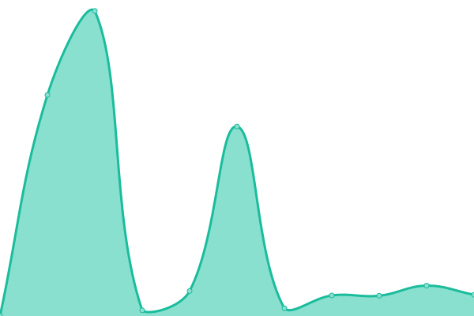 359ms
     
 | 

<a href="https://status.opentunnel.net/history/trojan-netherlands-nlb-1">99.73%</a>
    

|  [TROJAN 🇨🇦 Canada CAO 1](https://cat-1.optnl.com/) | 🟩 Up | [trojan-canada-cao-1.yml](https://github.com/roosterkid/opentunnel-status-server/commits/HEAD/history/trojan-canada-cao-1.yml) | 

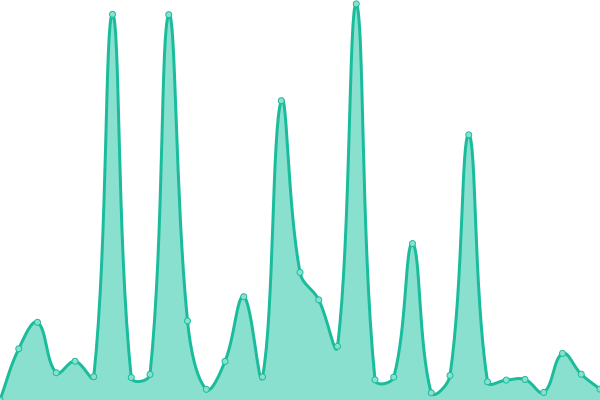 154ms
     
 | 

<a href="https://status.opentunnel.net/history/trojan-canada-cao-1">100.00%</a>
    

|  [TROJAN 🇺🇸 United States USF 1](https://ust-1.optnl.com/) | 🟩 Up | [trojan-united-states-usf-1.yml](https://github.com/roosterkid/opentunnel-status-server/commits/HEAD/history/trojan-united-states-usf-1.yml) | 

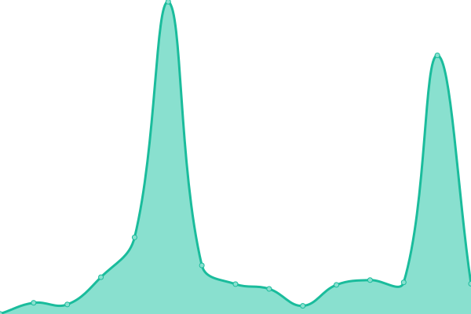 201ms
     
 | 

<a href="https://status.opentunnel.net/history/trojan-united-states-usf-1">30.62%</a>
    

|  [TROJAN 🇸🇬 Singapore SGA 1](https://sgt-3.optnl.com/) | 🟩 Up | [trojan-singapore-sga-1.yml](https://github.com/roosterkid/opentunnel-status-server/commits/HEAD/history/trojan-singapore-sga-1.yml) | 

 679ms
     
 | 

<a href="https://status.opentunnel.net/history/trojan-singapore-sga-1">100.00%</a>
    

|  [TROJAN 🇮🇩 Indonesia IDJ 1](https://idt-1.optnl.com/) | 🟩 Up | [trojan-indonesia-idj-1.yml](https://github.com/roosterkid/opentunnel-status-server/commits/HEAD/history/trojan-indonesia-idj-1.yml) | 

 3706ms
     
 | 

<a href="https://status.opentunnel.net/history/trojan-indonesia-idj-1">99.65%</a>
    

|  [TROJAN 🇬🇧 United Kingdom UKM 1](https://ukt-1.optnl.com/) | 🟩 Up | [trojan-united-kingdom-ukm-1.yml](https://github.com/roosterkid/opentunnel-status-server/commits/HEAD/history/trojan-united-kingdom-ukm-1.yml) | 

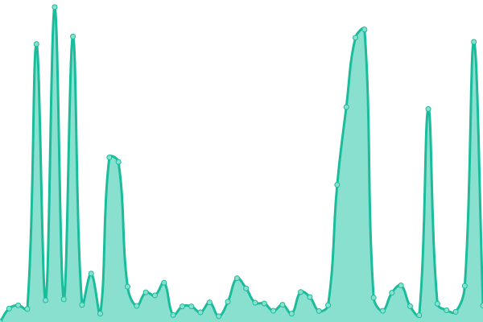 397ms
     
 | 

<a href="https://status.opentunnel.net/history/trojan-united-kingdom-ukm-1">99.63%</a>
    

|  [TROJAN 🇬🇧 United Kingdom UKO 2](https://ukt-2.optnl.com/) | 🟩 Up | [trojan-united-kingdom-uko-2.yml](https://github.com/roosterkid/opentunnel-status-server/commits/HEAD/history/trojan-united-kingdom-uko-2.yml) | 

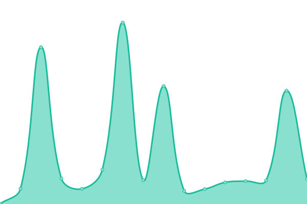 420ms
     
 | 

<a href="https://status.opentunnel.net/history/trojan-united-kingdom-uko-2">100.00%</a>
    

|  [TROJAN 🇺🇸 United States USO 1](https://ust-2.optnl.com/) | 🟩 Up | [trojan-united-states-uso-1.yml](https://github.com/roosterkid/opentunnel-status-server/commits/HEAD/history/trojan-united-states-uso-1.yml) | 

 636ms
     
 | 

<a href="https://status.opentunnel.net/history/trojan-united-states-uso-1">99.29%</a>
    

|  [SSH 🇺🇸 United States USF 1](http://uss-1.optnl.com:8080/) | 🟩 Up | [ssh-united-states-usf-1.yml](https://github.com/roosterkid/opentunnel-status-server/commits/HEAD/history/ssh-united-states-usf-1.yml) | 

 119ms
     
 | 

<a href="https://status.opentunnel.net/history/ssh-united-states-usf-1">30.63%</a>
    

|  [SSH 🇩🇪 Germany DEH 1](http://des-1.optnl.com:8080/) | 🟩 Up | [ssh-germany-deh-1.yml](https://github.com/roosterkid/opentunnel-status-server/commits/HEAD/history/ssh-germany-deh-1.yml) | 

 265ms
     
 | 

<a href="https://status.opentunnel.net/history/ssh-germany-deh-1">100.00%</a>
    

|  [SSH 🇸🇬 Singapore SGF 1](http://sgs-2.optnl.com:8080/) | 🟩 Up | [ssh-singapore-sgf-1.yml](https://github.com/roosterkid/opentunnel-status-server/commits/HEAD/history/ssh-singapore-sgf-1.yml) | 

 508ms
     
 | 

<a href="https://status.opentunnel.net/history/ssh-singapore-sgf-1">100.00%</a>
    

|  [SSH 🇸🇬 Singapore SGC 1](http://sgs-3.optnl.com:8080/) | 🟩 Up | [ssh-singapore-sgc-1.yml](https://github.com/roosterkid/opentunnel-status-server/commits/HEAD/history/ssh-singapore-sgc-1.yml) | 

 443ms
     
 | 

<a href="https://status.opentunnel.net/history/ssh-singapore-sgc-1">100.00%</a>
    

|  [SSH 🇫🇷 France FRO 1](http://frs-1.optnl.com:8080/) | 🟩 Up | [ssh-france-fro-1.yml](https://github.com/roosterkid/opentunnel-status-server/commits/HEAD/history/ssh-france-fro-1.yml) | 

 226ms
     
 | 

<a href="https://status.opentunnel.net/history/ssh-france-fro-1">100.00%</a>
    

|  [SSH 🇨🇦 Canada CAO 1](http://cas-1.optnl.com:8080/) | 🟩 Up | [ssh-canada-cao-1.yml](https://github.com/roosterkid/opentunnel-status-server/commits/HEAD/history/ssh-canada-cao-1.yml) | 

 79ms
     
 | 

<a href="https://status.opentunnel.net/history/ssh-canada-cao-1">30.13%</a>
    

|  [SSH 🇮🇩 Indonesia IDA 1](http://ids-2.optnl.com:8080/) | 🟩 Up | [ssh-indonesia-ida-1.yml](https://github.com/roosterkid/opentunnel-status-server/commits/HEAD/history/ssh-indonesia-ida-1.yml) | 

 708ms
     
 | 

<a href="https://status.opentunnel.net/history/ssh-indonesia-ida-1">99.77%</a>
    

|  [SSH 🇺🇸 United States USF 2](http://uss-2.optnl.com:8080/) | 🟩 Up | [ssh-united-states-usf-2.yml](https://github.com/roosterkid/opentunnel-status-server/commits/HEAD/history/ssh-united-states-usf-2.yml) | 

 113ms
     
 | 

<a href="https://status.opentunnel.net/history/ssh-united-states-usf-2">99.84%</a>
    

|  [SSH 🇩🇪 Germany DEO 2](http://des-2.optnl.com:8080/) | 🟩 Up | [ssh-germany-deo-2.yml](https://github.com/roosterkid/opentunnel-status-server/commits/HEAD/history/ssh-germany-deo-2.yml) | 

 270ms
     
 | 

<a href="https://status.opentunnel.net/history/ssh-germany-deo-2">100.00%</a>
    

|  [SSH 🇫🇷 France FRO 2](http://frs-2.optnl.com:8080/) | 🟩 Up | [ssh-france-fro-2.yml](https://github.com/roosterkid/opentunnel-status-server/commits/HEAD/history/ssh-france-fro-2.yml) | 

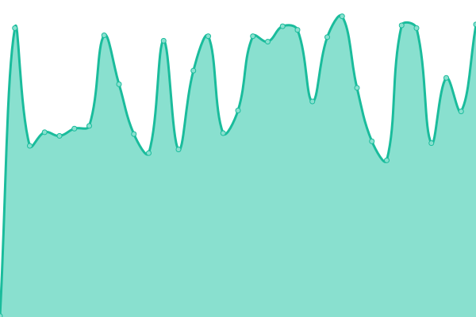 245ms
     
 | 

<a href="https://status.opentunnel.net/history/ssh-france-fro-2">100.00%</a>
    

|  [SSH 🇮🇩 Indonesia IDN 1](http://ids-3.optnl.com:8080/) | 🟩 Up | [ssh-indonesia-idn-1.yml](https://github.com/roosterkid/opentunnel-status-server/commits/HEAD/history/ssh-indonesia-idn-1.yml) | 

 484ms
     
 | 

<a href="https://status.opentunnel.net/history/ssh-indonesia-idn-1">100.00%</a>
    

|  [SSH 🇧🇬 Bulgaria BGI 1](http://bgs-1.optnl.com:8080/) | 🟩 Up | [ssh-bulgaria-bgi-1.yml](https://github.com/roosterkid/opentunnel-status-server/commits/HEAD/history/ssh-bulgaria-bgi-1.yml) | 

 298ms
     
 | 

<a href="https://status.opentunnel.net/history/ssh-bulgaria-bgi-1">98.82%</a>
    

|  [SSH 🇺🇦 Ukraine UAI 1](http://uas-1.optnl.com:8080/) | 🟩 Up | [ssh-ukraine-uai-1.yml](https://github.com/roosterkid/opentunnel-status-server/commits/HEAD/history/ssh-ukraine-uai-1.yml) | 

 331ms
     
 | 

<a href="https://status.opentunnel.net/history/ssh-ukraine-uai-1">98.97%</a>
    

|  [SSH 🇺🇸 United States USF 3](http://uss-3.optnl.com:8080/) | 🟩 Up | [ssh-united-states-usf-3.yml](https://github.com/roosterkid/opentunnel-status-server/commits/HEAD/history/ssh-united-states-usf-3.yml) | 

 82ms
     
 | 

<a href="https://status.opentunnel.net/history/ssh-united-states-usf-3">100.00%</a>
    

|  [SSH 🇱🇺 Luxembourg LUF 1](http://lus-1.optnl.com:8080/) | 🟩 Up | [ssh-luxembourg-luf-1.yml](https://github.com/roosterkid/opentunnel-status-server/commits/HEAD/history/ssh-luxembourg-luf-1.yml) | 

 317ms
     
 | 

<a href="https://status.opentunnel.net/history/ssh-luxembourg-luf-1">100.00%</a>
    

|  [SSH 🇬🇧 United Kingdom UKO 1](http://uks-1.optnl.com:8080/) | 🟩 Up | [ssh-united-kingdom-uko-1.yml](https://github.com/roosterkid/opentunnel-status-server/commits/HEAD/history/ssh-united-kingdom-uko-1.yml) | 

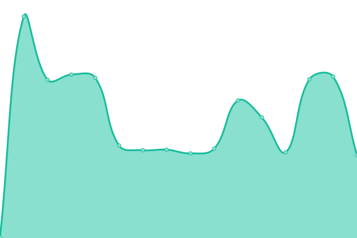 231ms
     
 | 

<a href="https://status.opentunnel.net/history/ssh-united-kingdom-uko-1">100.00%</a>
    

|  [SSH 🇨🇦 Canada CAO 2](http://cas-2.optnl.com:8080/) | 🟩 Up | [ssh-canada-cao-2.yml](https://github.com/roosterkid/opentunnel-status-server/commits/HEAD/history/ssh-canada-cao-2.yml) | 

 93ms
     
 | 

<a href="https://status.opentunnel.net/history/ssh-canada-cao-2">100.00%</a>
    

|  [SSH 🇸🇬 Singapore XSG 1](http://xs-1.optnl.com:8080/) | 🟩 Up | [ssh-singapore-xsg-1.yml](https://github.com/roosterkid/opentunnel-status-server/commits/HEAD/history/ssh-singapore-xsg-1.yml) | 

 454ms
     
 | 

<a href="https://status.opentunnel.net/history/ssh-singapore-xsg-1">100.00%</a>
    

|  [SSH 🇸🇬 Singapore XSG 2](http://xs-2.optnl.com:8080/) | 🟩 Up | [ssh-singapore-xsg-2.yml](https://github.com/roosterkid/opentunnel-status-server/commits/HEAD/history/ssh-singapore-xsg-2.yml) | 

 525ms
     
 | 

<a href="https://status.opentunnel.net/history/ssh-singapore-xsg-2">100.00%</a>
    

|  [SSH 🇫🇷 France FRO 3](http://frs-3.optnl.com:8080/) | 🟩 Up | [ssh-france-fro-3.yml](https://github.com/roosterkid/opentunnel-status-server/commits/HEAD/history/ssh-france-fro-3.yml) | 

 224ms
     
 | 

<a href="https://status.opentunnel.net/history/ssh-france-fro-3">100.00%</a>
    

|  [SSH 🇺🇸 United States USO 1](http://uss-4.optnl.com:8080/) | 🟩 Up | [ssh-united-states-uso-1.yml](https://github.com/roosterkid/opentunnel-status-server/commits/HEAD/history/ssh-united-states-uso-1.yml) | 

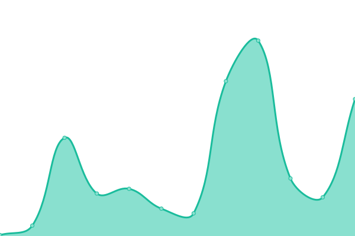 101ms
     
 | 

<a href="https://status.opentunnel.net/history/ssh-united-states-uso-1">100.00%</a>
    

|  [SSH 🇬🇧 United Kingdom UKO 1](http://uks-2.optnl.com:8080/) | 🟩 Up | [ssh-united-kingdom-uko-1.yml](https://github.com/roosterkid/opentunnel-status-server/commits/HEAD/history/ssh-united-kingdom-uko-1.yml) | 

 231ms
     
 | 

<a href="https://status.opentunnel.net/history/ssh-united-kingdom-uko-1">100.00%</a>
    

|  [SSH 🇱🇺 Luxembourg LUF 2](http://lus-2.optnl.com:8080/) | 🟩 Up | [ssh-luxembourg-luf-2.yml](https://github.com/roosterkid/opentunnel-status-server/commits/HEAD/history/ssh-luxembourg-luf-2.yml) | 

 240ms
     
 | 

<a href="https://status.opentunnel.net/history/ssh-luxembourg-luf-2">100.00%</a>
    

|  [PPTP 🇸🇬 Singapore SGC 1](http://sgp-1.optnl.com/) | 🟩 Up | [pptp-singapore-sgc-1.yml](https://github.com/roosterkid/opentunnel-status-server/commits/HEAD/history/pptp-singapore-sgc-1.yml) | 

 430ms
     
 | 

<a href="https://status.opentunnel.net/history/pptp-singapore-sgc-1">100.00%</a>
    

|  [PPTP 🇺🇸 United States USF 1](http://usp-1.optnl.com/) | 🟩 Up | [pptp-united-states-usf-1.yml](https://github.com/roosterkid/opentunnel-status-server/commits/HEAD/history/pptp-united-states-usf-1.yml) | 

 117ms
     
 | 

<a href="https://status.opentunnel.net/history/pptp-united-states-usf-1">100.00%</a>
    

|  [PPTP 🇫🇷 France FRT 1](http://frp-1.optnl.com/) | 🟩 Up | [pptp-france-frt-1.yml](https://github.com/roosterkid/opentunnel-status-server/commits/HEAD/history/pptp-france-frt-1.yml) | 

 237ms
     
 | 

<a href="https://status.opentunnel.net/history/pptp-france-frt-1">100.00%</a>
    

|  [PPTP 🇬🇧 United Kingdom UKO 1](http://ukp-1.optnl.com/) | 🟩 Up | [pptp-united-kingdom-uko-1.yml](https://github.com/roosterkid/opentunnel-status-server/commits/HEAD/history/pptp-united-kingdom-uko-1.yml) | 

 232ms
     
 | 

<a href="https://status.opentunnel.net/history/pptp-united-kingdom-uko-1">100.00%</a>
    

|  [PPTP 🇨🇦 Canada CAO 1](http://cap-1.optnl.com/) | 🟩 Up | [pptp-canada-cao-1.yml](https://github.com/roosterkid/opentunnel-status-server/commits/HEAD/history/pptp-canada-cao-1.yml) | 

 97ms
     
 | 

<a href="https://status.opentunnel.net/history/pptp-canada-cao-1">30.63%</a>
    

|  [PPTP 🇺🇸 United States USO 1](http://usp-2.optnl.com/) | 🟩 Up | [pptp-united-states-uso-1.yml](https://github.com/roosterkid/opentunnel-status-server/commits/HEAD/history/pptp-united-states-uso-1.yml) | 

 77ms
     
 | 

<a href="https://status.opentunnel.net/history/pptp-united-states-uso-1">100.00%</a>
    

|  [OVPN 🇸🇬 Singapore SGC 1](http://sgo-1.optnl.com:8080/) | 🟩 Up | [ovpn-singapore-sgc-1.yml](https://github.com/roosterkid/opentunnel-status-server/commits/HEAD/history/ovpn-singapore-sgc-1.yml) | 

 437ms
     
 | 

<a href="https://status.opentunnel.net/history/ovpn-singapore-sgc-1">100.00%</a>
    

|  [OVPN 🇺🇸 United States USF 1](http://uso-1.optnl.com:8080/) | 🟩 Up | [ovpn-united-states-usf-1.yml](https://github.com/roosterkid/opentunnel-status-server/commits/HEAD/history/ovpn-united-states-usf-1.yml) | 

 119ms
     
 | 

<a href="https://status.opentunnel.net/history/ovpn-united-states-usf-1">100.00%</a>
    

|  [OVPN 🇸🇬 Singapore SGC 2](http://sgo-2.optnl.com:8080/) | 🟩 Up | [ovpn-singapore-sgc-2.yml](https://github.com/roosterkid/opentunnel-status-server/commits/HEAD/history/ovpn-singapore-sgc-2.yml) | 

 372ms
     
 | 

<a href="https://status.opentunnel.net/history/ovpn-singapore-sgc-2">100.00%</a>
    

|  [OVPN 🇫🇷 France FRO 1](http://fro-1.optnl.com:8080/) | 🟩 Up | [ovpn-france-fro-1.yml](https://github.com/roosterkid/opentunnel-status-server/commits/HEAD/history/ovpn-france-fro-1.yml) | 

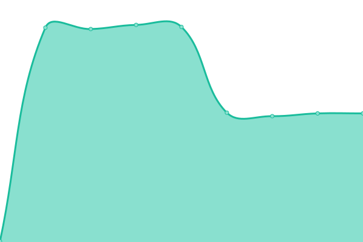 214ms
     
 | 

<a href="https://status.opentunnel.net/history/ovpn-france-fro-1">100.00%</a>
    

|  [OVPN 🇺🇸 United States USQ 1](http://uso-2.optnl.com:8080/) | 🟩 Up | [ovpn-united-states-usq-1.yml](https://github.com/roosterkid/opentunnel-status-server/commits/HEAD/history/ovpn-united-states-usq-1.yml) | 

 95ms
     
 | 

<a href="https://status.opentunnel.net/history/ovpn-united-states-usq-1">100.00%</a>
    

|  [OVPN 🇨🇦 Canada CAO 1](http://cao-1.optnl.com:8080/) | 🟩 Up | [ovpn-canada-cao-1.yml](https://github.com/roosterkid/opentunnel-status-server/commits/HEAD/history/ovpn-canada-cao-1.yml) | 

 75ms
     
 | 

<a href="https://status.opentunnel.net/history/ovpn-canada-cao-1">100.00%</a>
    

|  [OVPN 🇳🇱 Netherlands NLL 1](http://nlo-1.optnl.com:8080/) | 🟩 Up | [ovpn-netherlands-nll-1.yml](https://github.com/roosterkid/opentunnel-status-server/commits/HEAD/history/ovpn-netherlands-nll-1.yml) | 

 213ms
     
 | 

<a href="https://status.opentunnel.net/history/ovpn-netherlands-nll-1">100.00%</a>
    

<!--end: status pages-->

[**Visit our status website →**](https://status.opentunnel.net)

## 📄 License

- Powered by: [Upptime](https://github.com/upptime/upptime)
- Code: [MIT](./LICENSE) © [roosterkid](https://status.opentunnel.net)
- Data in the `./history` directory: [Open Database License](https://opendatacommons.org/licenses/odbl/1-0/)
