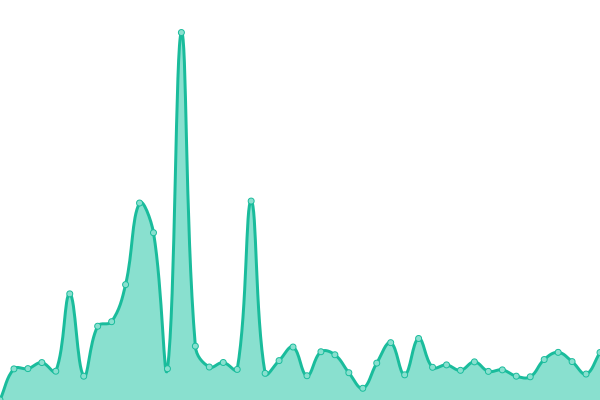

# [📈 Live Status](https://status.opentunnel.net): <!--live status--> **🟧 Partial outage**

This repository contains the open-source uptime monitor and status page for [roosterkid](https://status.opentunnel.net), powered by [Upptime](https://github.com/upptime/upptime).

With [Upptime](https://upptime.js.org), you can get your own unlimited and free uptime monitor and status page, powered entirely by a GitHub repository. We use [Issues](https://github.com/roosterkid/opentunnel-status-server/issues) as incident reports, [Actions](https://github.com/roosterkid/opentunnel-status-server/actions) as uptime monitors, and [Pages](https://status.opentunnel.net) for the status page.

<!--start: status pages-->
<!-- This summary is generated by Upptime (https://github.com/upptime/upptime) -->
<!-- Do not edit this manually, your changes will be overwritten -->
<!-- prettier-ignore -->
| URL | Status | History | Response Time | Uptime |
| --- | ------ | ------- | ------------- | ------ |
|  [OpenTunnel.net Website](https://opentunnel.net/) | 🟩 Up | [open-tunnel-net-website.yml](https://github.com/roosterkid/opentunnel-status-server/commits/HEAD/history/open-tunnel-net-website.yml) | 

 471ms
     
 | 

<a href="https://status.opentunnel.net/history/open-tunnel-net-website">100.00%</a>
    

|  [OpenTunnel.net Community](https://forum.opentunnel.net/) | 🟩 Up | [open-tunnel-net-community.yml](https://github.com/roosterkid/opentunnel-status-server/commits/HEAD/history/open-tunnel-net-community.yml) | 

 548ms
     
 | 

<a href="https://status.opentunnel.net/history/open-tunnel-net-community">100.00%</a>
    

|  [OpenTunnel.net VIP Panel](https://client.opentunnel.net/) | 🟩 Up | [open-tunnel-net-vip-panel.yml](https://github.com/roosterkid/opentunnel-status-server/commits/HEAD/history/open-tunnel-net-vip-panel.yml) | 

 439ms
     
 | 

<a href="https://status.opentunnel.net/history/open-tunnel-net-vip-panel">100.00%</a>
    

|  [XRAY 🇫🇷 France FRF 1](https://frx-1.openv2ray.com/) | 🟩 Up | [xray-france-frf-1.yml](https://github.com/roosterkid/opentunnel-status-server/commits/HEAD/history/xray-france-frf-1.yml) | 

 386ms
     
 | 

<a href="https://status.opentunnel.net/history/xray-france-frf-1">99.80%</a>
    

|  [XRAY 🇺🇸 United States USF 1](https://usx-1.openv2ray.com/) | 🟩 Up | [xray-united-states-usf-1.yml](https://github.com/roosterkid/opentunnel-status-server/commits/HEAD/history/xray-united-states-usf-1.yml) | 

 262ms
     
 | 

<a href="https://status.opentunnel.net/history/xray-united-states-usf-1">99.80%</a>
    

|  [XRAY 🇮🇩 Indonesia IDA 1](https://idx-1.openv2ray.com/) | 🟩 Up | [xray-indonesia-ida-1.yml](https://github.com/roosterkid/opentunnel-status-server/commits/HEAD/history/xray-indonesia-ida-1.yml) | 

 763ms
     
 | 

<a href="https://status.opentunnel.net/history/xray-indonesia-ida-1">97.04%</a>
    

|  [XRAY 🇸🇬 Singapore SGO 2](https://sgx-3.openv2ray.com/) | 🟥 Down | [xray-singapore-sgo-2.yml](https://github.com/roosterkid/opentunnel-status-server/commits/HEAD/history/xray-singapore-sgo-2.yml) | 

 1141ms
     
 | 

<a href="https://status.opentunnel.net/history/xray-singapore-sgo-2">90.33%</a>
    

|  [XRAY 🇨🇦 Canada CAO 1](https://cax-1.openv2ray.com/) | 🟩 Up | [xray-canada-cao-1.yml](https://github.com/roosterkid/opentunnel-status-server/commits/HEAD/history/xray-canada-cao-1.yml) | 

 336ms
     
 | 

<a href="https://status.opentunnel.net/history/xray-canada-cao-1">99.39%</a>
    

|  [XRAY 🇬🇧 United Kingdom UKH 1](https://ukx-1.openv2ray.com/) | 🟩 Up | [xray-united-kingdom-ukh-1.yml](https://github.com/roosterkid/opentunnel-status-server/commits/HEAD/history/xray-united-kingdom-ukh-1.yml) | 

 303ms
     
 | 

<a href="https://status.opentunnel.net/history/xray-united-kingdom-ukh-1">100.00%</a>
    

|  [WG 🇺🇸 United States USF 1](http://wg-us-1.optnl.com/) | 🟩 Up | [wg-united-states-usf-1.yml](https://github.com/roosterkid/opentunnel-status-server/commits/HEAD/history/wg-united-states-usf-1.yml) | 

 175ms
     
 | 

<a href="https://status.opentunnel.net/history/wg-united-states-usf-1">100.00%</a>
    

|  [WG 🇸🇬 Singapore SGC 1](http://wg-sg-2.optnl.com/) | 🟩 Up | [wg-singapore-sgc-1.yml](https://github.com/roosterkid/opentunnel-status-server/commits/HEAD/history/wg-singapore-sgc-1.yml) | 

 511ms
     
 | 

<a href="https://status.opentunnel.net/history/wg-singapore-sgc-1">100.00%</a>
    

|  [WG 🇫🇷 France FRF 1](http://wg-fr-1.optnl.com/) | 🟩 Up | [wg-france-frf-1.yml](https://github.com/roosterkid/opentunnel-status-server/commits/HEAD/history/wg-france-frf-1.yml) | 

 224ms
     
 | 

<a href="https://status.opentunnel.net/history/wg-france-frf-1">100.00%</a>
    

|  [V2RAY 🇸🇬 Singapore SGF 1](https://sgv-1.openv2ray.com/) | 🟩 Up | [v2-ray-singapore-sgf-1.yml](https://github.com/roosterkid/opentunnel-status-server/commits/HEAD/history/v2-ray-singapore-sgf-1.yml) | 

 709ms
     
 | 

<a href="https://status.opentunnel.net/history/v2-ray-singapore-sgf-1">97.09%</a>
    

|  [V2RAY 🇸🇬 Singapore SGF 2](https://sgv-2.openv2ray.com/) | 🟩 Up | [v2-ray-singapore-sgf-2.yml](https://github.com/roosterkid/opentunnel-status-server/commits/HEAD/history/v2-ray-singapore-sgf-2.yml) | 

 929ms
     
 | 

<a href="https://status.opentunnel.net/history/v2-ray-singapore-sgf-2">98.60%</a>
    

|  [V2RAY 🇺🇸 United States USF 1](https://usv-1.openv2ray.com/) | 🟩 Up | [v2-ray-united-states-usf-1.yml](https://github.com/roosterkid/opentunnel-status-server/commits/HEAD/history/v2-ray-united-states-usf-1.yml) | 

 219ms
     
 | 

<a href="https://status.opentunnel.net/history/v2-ray-united-states-usf-1">99.45%</a>
    

|  [V2RAY 🇸🇬 Singapore SGF 3](https://sgv-3.openv2ray.com/) | 🟩 Up | [v2-ray-singapore-sgf-3.yml](https://github.com/roosterkid/opentunnel-status-server/commits/HEAD/history/v2-ray-singapore-sgf-3.yml) | 

 878ms
     
 | 

<a href="https://status.opentunnel.net/history/v2-ray-singapore-sgf-3">96.72%</a>
    

|  [V2RAY 🇸🇬 Singapore SGF 4](https://sgv-4.openv2ray.com/) | 🟩 Up | [v2-ray-singapore-sgf-4.yml](https://github.com/roosterkid/opentunnel-status-server/commits/HEAD/history/v2-ray-singapore-sgf-4.yml) | 

 577ms
     
 | 

<a href="https://status.opentunnel.net/history/v2-ray-singapore-sgf-4">88.79%</a>
    

|  [V2RAY 🇺🇸 United States USF 2](https://usv-2.openv2ray.com/) | 🟩 Up | [v2-ray-united-states-usf-2.yml](https://github.com/roosterkid/opentunnel-status-server/commits/HEAD/history/v2-ray-united-states-usf-2.yml) | 

 235ms
     
 | 

<a href="https://status.opentunnel.net/history/v2-ray-united-states-usf-2">91.75%</a>
    

|  [V2RAY 🇺🇸 United States USF 3](https://usv-3.openv2ray.com/) | 🟩 Up | [v2-ray-united-states-usf-3.yml](https://github.com/roosterkid/opentunnel-status-server/commits/HEAD/history/v2-ray-united-states-usf-3.yml) | 

 579ms
     
 | 

<a href="https://status.opentunnel.net/history/v2-ray-united-states-usf-3">48.45%</a>
    

|  [V2RAY 🇳🇱 Netherlands NLI 1](https://nlv-6.openv2ray.com/) | 🟩 Up | [v2-ray-netherlands-nli-1.yml](https://github.com/roosterkid/opentunnel-status-server/commits/HEAD/history/v2-ray-netherlands-nli-1.yml) | 

 686ms
     
 | 

<a href="https://status.opentunnel.net/history/v2-ray-netherlands-nli-1">97.95%</a>
    

|  [V2RAY 🇺🇸 United States USO 1](https://usv-4.openv2ray.com/) | 🟩 Up | [v2-ray-united-states-uso-1.yml](https://github.com/roosterkid/opentunnel-status-server/commits/HEAD/history/v2-ray-united-states-uso-1.yml) | 

 217ms
     
 | 

<a href="https://status.opentunnel.net/history/v2-ray-united-states-uso-1">99.76%</a>
    

|  [V2RAY 🇱🇻 Latvia LVH 1](https://lvv-1.openv2ray.com/) | 🟩 Up | [v2-ray-latvia-lvh-1.yml](https://github.com/roosterkid/opentunnel-status-server/commits/HEAD/history/v2-ray-latvia-lvh-1.yml) | 

 358ms
     
 | 

<a href="https://status.opentunnel.net/history/v2-ray-latvia-lvh-1">100.00%</a>
    

|  [V2RAY 🇫🇷 France FR 1](https://frv-1.openv2ray.com/) | 🟩 Up | [v2-ray-france-fr-1.yml](https://github.com/roosterkid/opentunnel-status-server/commits/HEAD/history/v2-ray-france-fr-1.yml) | 

 1172ms
     
 | 

<a href="https://status.opentunnel.net/history/v2-ray-france-fr-1">87.10%</a>
    

|  [TROJAN 🇸🇬 Singapore SGV 1](https://sgt-1.optnl.com/) | 🟩 Up | [trojan-singapore-sgv-1.yml](https://github.com/roosterkid/opentunnel-status-server/commits/HEAD/history/trojan-singapore-sgv-1.yml) | 

 1392ms
     
 | 

<a href="https://status.opentunnel.net/history/trojan-singapore-sgv-1">96.98%</a>
    

|  [TROJAN 🇩🇪 Germany DEO 1](https://det-1.optnl.com/) | 🟩 Up | [trojan-germany-deo-1.yml](https://github.com/roosterkid/opentunnel-status-server/commits/HEAD/history/trojan-germany-deo-1.yml) | 

 323ms
     
 | 

<a href="https://status.opentunnel.net/history/trojan-germany-deo-1">100.00%</a>
    

|  [TROJAN 🇳🇱 Netherlands NLB 1](https://nlt-1.optnl.com/) | 🟩 Up | [trojan-netherlands-nlb-1.yml](https://github.com/roosterkid/opentunnel-status-server/commits/HEAD/history/trojan-netherlands-nlb-1.yml) | 

 711ms
     
 | 

<a href="https://status.opentunnel.net/history/trojan-netherlands-nlb-1">99.41%</a>
    

|  [TROJAN 🇺🇸 United States USF 1](https://ust-1.optnl.com/) | 🟩 Up | [trojan-united-states-usf-1.yml](https://github.com/roosterkid/opentunnel-status-server/commits/HEAD/history/trojan-united-states-usf-1.yml) | 

 814ms
     
 | 

<a href="https://status.opentunnel.net/history/trojan-united-states-usf-1">99.24%</a>
    

|  [TROJAN 🇬🇧 United Kingdom UKM 1](https://ukt-1.optnl.com/) | 🟩 Up | [trojan-united-kingdom-ukm-1.yml](https://github.com/roosterkid/opentunnel-status-server/commits/HEAD/history/trojan-united-kingdom-ukm-1.yml) | 

 920ms
     
 | 

<a href="https://status.opentunnel.net/history/trojan-united-kingdom-ukm-1">97.25%</a>
    

|  [TROJAN 🇬🇧 United Kingdom UKH 2](https://ukt-2.optnl.com/) | 🟩 Up | [trojan-united-kingdom-ukh-2.yml](https://github.com/roosterkid/opentunnel-status-server/commits/HEAD/history/trojan-united-kingdom-ukh-2.yml) | 

 714ms
     
 | 

<a href="https://status.opentunnel.net/history/trojan-united-kingdom-ukh-2">95.49%</a>
    

|  [TROJAN 🇺🇸 United States USO 1](https://ust-2.optnl.com/) | 🟩 Up | [trojan-united-states-uso-1.yml](https://github.com/roosterkid/opentunnel-status-server/commits/HEAD/history/trojan-united-states-uso-1.yml) | 

 1075ms
     
 | 

<a href="https://status.opentunnel.net/history/trojan-united-states-uso-1">88.04%</a>
    

|  [SSH 🇺🇸 United States USF 1](http://uss-1.optnl.com:8080/) | 🟩 Up | [ssh-united-states-usf-1.yml](https://github.com/roosterkid/opentunnel-status-server/commits/HEAD/history/ssh-united-states-usf-1.yml) | 

 148ms
     
 | 

<a href="https://status.opentunnel.net/history/ssh-united-states-usf-1">99.84%</a>
    

|  [SSH 🇩🇪 Germany DEH 1](http://des-1.optnl.com:8080/) | 🟩 Up | [ssh-germany-deh-1.yml](https://github.com/roosterkid/opentunnel-status-server/commits/HEAD/history/ssh-germany-deh-1.yml) | 

 229ms
     
 | 

<a href="https://status.opentunnel.net/history/ssh-germany-deh-1">99.85%</a>
    

|  [SSH 🇸🇬 Singapore SGF 1](http://sgs-2.optnl.com:8080/) | 🟩 Up | [ssh-singapore-sgf-1.yml](https://github.com/roosterkid/opentunnel-status-server/commits/HEAD/history/ssh-singapore-sgf-1.yml) | 

 666ms
     
 | 

<a href="https://status.opentunnel.net/history/ssh-singapore-sgf-1">99.61%</a>
    

|  [SSH 🇸🇬 Singapore SGC 1](http://sgs-3.optnl.com:8080/) | 🟩 Up | [ssh-singapore-sgc-1.yml](https://github.com/roosterkid/opentunnel-status-server/commits/HEAD/history/ssh-singapore-sgc-1.yml) | 

 482ms
     
 | 

<a href="https://status.opentunnel.net/history/ssh-singapore-sgc-1">99.81%</a>
    

|  [SSH 🇫🇷 France FRO 1](http://frs-1.optnl.com:8080/) | 🟩 Up | [ssh-france-fro-1.yml](https://github.com/roosterkid/opentunnel-status-server/commits/HEAD/history/ssh-france-fro-1.yml) | 

 206ms
     
 | 

<a href="https://status.opentunnel.net/history/ssh-france-fro-1">99.82%</a>
    

|  [SSH 🇨🇦 Canada CAO 1](http://cas-1.optnl.com:8080/) | 🟩 Up | [ssh-canada-cao-1.yml](https://github.com/roosterkid/opentunnel-status-server/commits/HEAD/history/ssh-canada-cao-1.yml) | 

 64ms
     
 | 

<a href="https://status.opentunnel.net/history/ssh-canada-cao-1">100.00%</a>
    

|  [SSH 🇮🇩 Indonesia IDA 1](http://ids-2.optnl.com:8080/) | 🟩 Up | [ssh-indonesia-ida-1.yml](https://github.com/roosterkid/opentunnel-status-server/commits/HEAD/history/ssh-indonesia-ida-1.yml) | 

 519ms
     
 | 

<a href="https://status.opentunnel.net/history/ssh-indonesia-ida-1">94.18%</a>
    

|  [SSH 🇺🇸 United States USF 2](http://uss-2.optnl.com:8080/) | 🟩 Up | [ssh-united-states-usf-2.yml](https://github.com/roosterkid/opentunnel-status-server/commits/HEAD/history/ssh-united-states-usf-2.yml) | 

 61ms
     
 | 

<a href="https://status.opentunnel.net/history/ssh-united-states-usf-2">99.65%</a>
    

|  [SSH 🇩🇪 Germany DEO 2](http://des-2.optnl.com:8080/) | 🟩 Up | [ssh-germany-deo-2.yml](https://github.com/roosterkid/opentunnel-status-server/commits/HEAD/history/ssh-germany-deo-2.yml) | 

 239ms
     
 | 

<a href="https://status.opentunnel.net/history/ssh-germany-deo-2">100.00%</a>
    

|  [SSH 🇫🇷 France FRO 2](http://frs-2.optnl.com:8080/) | 🟥 Down | [ssh-france-fro-2.yml](https://github.com/roosterkid/opentunnel-status-server/commits/HEAD/history/ssh-france-fro-2.yml) | 

 363ms
     
 | 

<a href="https://status.opentunnel.net/history/ssh-france-fro-2">97.39%</a>
    

|  [SSH 🇧🇬 Bulgaria BGI 1](http://bgs-1.optnl.com:8080/) | 🟩 Up | [ssh-bulgaria-bgi-1.yml](https://github.com/roosterkid/opentunnel-status-server/commits/HEAD/history/ssh-bulgaria-bgi-1.yml) | 

 261ms
     
 | 

<a href="https://status.opentunnel.net/history/ssh-bulgaria-bgi-1">100.00%</a>
    

|  [SSH 🇺🇦 Ukraine UAI 1](http://uas-1.optnl.com:8080/) | 🟩 Up | [ssh-ukraine-uai-1.yml](https://github.com/roosterkid/opentunnel-status-server/commits/HEAD/history/ssh-ukraine-uai-1.yml) | 

 265ms
     
 | 

<a href="https://status.opentunnel.net/history/ssh-ukraine-uai-1">100.00%</a>
    

|  [SSH 🇺🇸 United States USF 3](http://uss-3.optnl.com:8080/) | 🟩 Up | [ssh-united-states-usf-3.yml](https://github.com/roosterkid/opentunnel-status-server/commits/HEAD/history/ssh-united-states-usf-3.yml) | 

 37ms
     
 | 

<a href="https://status.opentunnel.net/history/ssh-united-states-usf-3">100.00%</a>
    

|  [SSH 🇱🇺 Luxembourg LUF 1](http://lus-1.optnl.com:8080/) | 🟩 Up | [ssh-luxembourg-luf-1.yml](https://github.com/roosterkid/opentunnel-status-server/commits/HEAD/history/ssh-luxembourg-luf-1.yml) | 

 213ms
     
 | 

<a href="https://status.opentunnel.net/history/ssh-luxembourg-luf-1">99.83%</a>
    

|  [SSH 🇬🇧 United Kingdom UKH 1](http://uks-1.optnl.com:8080/) | 🟩 Up | [ssh-united-kingdom-ukh-1.yml](https://github.com/roosterkid/opentunnel-status-server/commits/HEAD/history/ssh-united-kingdom-ukh-1.yml) | 

 195ms
     
 | 

<a href="https://status.opentunnel.net/history/ssh-united-kingdom-ukh-1">100.00%</a>
    

|  [SSH 🇨🇦 Canada CAO 2](http://cas-2.optnl.com:8080/) | 🟩 Up | [ssh-canada-cao-2.yml](https://github.com/roosterkid/opentunnel-status-server/commits/HEAD/history/ssh-canada-cao-2.yml) | 

 102ms
     
 | 

<a href="https://status.opentunnel.net/history/ssh-canada-cao-2">66.78%</a>
    

|  [SSH 🇭🇰 Hong Kong XSR 1](http://xs-1.optnl.com:8080/) | 🟩 Up | [ssh-hong-kong-xsr-1.yml](https://github.com/roosterkid/opentunnel-status-server/commits/HEAD/history/ssh-hong-kong-xsr-1.yml) | 

 391ms
     
 | 

<a href="https://status.opentunnel.net/history/ssh-hong-kong-xsr-1">100.00%</a>
    

|  [SSH 🇹🇷 Türkiye XSR 2](http://xs-2.optnl.com:8080/) | 🟩 Up | [ssh-tuerkiye-xsr-2.yml](https://github.com/roosterkid/opentunnel-status-server/commits/HEAD/history/ssh-tuerkiye-xsr-2.yml) | 

 278ms
     
 | 

<a href="https://status.opentunnel.net/history/ssh-tuerkiye-xsr-2">100.00%</a>
    

|  [SSH 🇫🇷 France FRO 3](http://frs-3.optnl.com:8080/) | 🟩 Up | [ssh-france-fro-3.yml](https://github.com/roosterkid/opentunnel-status-server/commits/HEAD/history/ssh-france-fro-3.yml) | 

 176ms
     
 | 

<a href="https://status.opentunnel.net/history/ssh-france-fro-3">100.00%</a>
    

|  [SSH 🇺🇸 United States USO 1](http://uss-4.optnl.com:8080/) | 🟩 Up | [ssh-united-states-uso-1.yml](https://github.com/roosterkid/opentunnel-status-server/commits/HEAD/history/ssh-united-states-uso-1.yml) | 

 66ms
     
 | 

<a href="https://status.opentunnel.net/history/ssh-united-states-uso-1">100.00%</a>
    

|  [SSH 🇬🇧 United Kingdom UKH 2](http://uks-2.optnl.com:8080/) | 🟩 Up | [ssh-united-kingdom-ukh-2.yml](https://github.com/roosterkid/opentunnel-status-server/commits/HEAD/history/ssh-united-kingdom-ukh-2.yml) | 

 183ms
     
 | 

<a href="https://status.opentunnel.net/history/ssh-united-kingdom-ukh-2">100.00%</a>
    

|  [SSH 🇷🇺 Russia RUH 1](http://rus-1.optnl.com:8080/) | 🟩 Up | [ssh-russia-ruh-1.yml](https://github.com/roosterkid/opentunnel-status-server/commits/HEAD/history/ssh-russia-ruh-1.yml) | 

 266ms
     
 | 

<a href="https://status.opentunnel.net/history/ssh-russia-ruh-1">99.60%</a>
    

|  [SSH 🇱🇺 Luxembourg LUF 2](http://lus-2.optnl.com:8080/) | 🟩 Up | [ssh-luxembourg-luf-2.yml](https://github.com/roosterkid/opentunnel-status-server/commits/HEAD/history/ssh-luxembourg-luf-2.yml) | 

 195ms
     
 | 

<a href="https://status.opentunnel.net/history/ssh-luxembourg-luf-2">99.75%</a>
    

|  [PPTP 🇸🇬 Singapore SGC 1](http://sgp-1.optnl.com/) | 🟩 Up | [pptp-singapore-sgc-1.yml](https://github.com/roosterkid/opentunnel-status-server/commits/HEAD/history/pptp-singapore-sgc-1.yml) | 

 485ms
     
 | 

<a href="https://status.opentunnel.net/history/pptp-singapore-sgc-1">98.98%</a>
    

|  [PPTP 🇺🇸 United States USF 1](http://usp-1.optnl.com/) | 🟩 Up | [pptp-united-states-usf-1.yml](https://github.com/roosterkid/opentunnel-status-server/commits/HEAD/history/pptp-united-states-usf-1.yml) | 

 116ms
     
 | 

<a href="https://status.opentunnel.net/history/pptp-united-states-usf-1">99.84%</a>
    

|  [PPTP 🇫🇷 France FRT 1](http://frp-1.optnl.com/) | 🟩 Up | [pptp-france-frt-1.yml](https://github.com/roosterkid/opentunnel-status-server/commits/HEAD/history/pptp-france-frt-1.yml) | 

 191ms
     
 | 

<a href="https://status.opentunnel.net/history/pptp-france-frt-1">99.76%</a>
    

|  [PPTP 🇺🇸 United States USO 1](http://usp-2.optnl.com/) | 🟩 Up | [pptp-united-states-uso-1.yml](https://github.com/roosterkid/opentunnel-status-server/commits/HEAD/history/pptp-united-states-uso-1.yml) | 

 24ms
     
 | 

<a href="https://status.opentunnel.net/history/pptp-united-states-uso-1">100.00%</a>
    

|  [OVPN 🇸🇬 Singapore SGC 1](http://sgo-1.optnl.com:8080/) | 🟩 Up | [ovpn-singapore-sgc-1.yml](https://github.com/roosterkid/opentunnel-status-server/commits/HEAD/history/ovpn-singapore-sgc-1.yml) | 

 472ms
     
 | 

<a href="https://status.opentunnel.net/history/ovpn-singapore-sgc-1">99.65%</a>
    

|  [OVPN 🇺🇸 United States USF 1](http://uso-1.optnl.com:8080/) | 🟩 Up | [ovpn-united-states-usf-1.yml](https://github.com/roosterkid/opentunnel-status-server/commits/HEAD/history/ovpn-united-states-usf-1.yml) | 

 134ms
     
 | 

<a href="https://status.opentunnel.net/history/ovpn-united-states-usf-1">100.00%</a>
    

|  [OVPN 🇸🇬 Singapore SGC 2](http://sgo-2.optnl.com:8080/) | 🟩 Up | [ovpn-singapore-sgc-2.yml](https://github.com/roosterkid/opentunnel-status-server/commits/HEAD/history/ovpn-singapore-sgc-2.yml) | 

 475ms
     
 | 

<a href="https://status.opentunnel.net/history/ovpn-singapore-sgc-2">100.00%</a>
    

|  [OVPN 🇫🇷 France FRO 1](http://fro-1.optnl.com:8080/) | 🟩 Up | [ovpn-france-fro-1.yml](https://github.com/roosterkid/opentunnel-status-server/commits/HEAD/history/ovpn-france-fro-1.yml) | 

 211ms
     
 | 

<a href="https://status.opentunnel.net/history/ovpn-france-fro-1">98.59%</a>
    

|  [OVPN 🇺🇸 United States USQ 1](http://uso-2.optnl.com:8080/) | 🟩 Up | [ovpn-united-states-usq-1.yml](https://github.com/roosterkid/opentunnel-status-server/commits/HEAD/history/ovpn-united-states-usq-1.yml) | 

 69ms
     
 | 

<a href="https://status.opentunnel.net/history/ovpn-united-states-usq-1">100.00%</a>
    

|  [OVPN 🇨🇦 Canada CAO 1](http://cao-1.optnl.com:8080/) | 🟩 Up | [ovpn-canada-cao-1.yml](https://github.com/roosterkid/opentunnel-status-server/commits/HEAD/history/ovpn-canada-cao-1.yml) | 

 62ms
     
 | 

<a href="https://status.opentunnel.net/history/ovpn-canada-cao-1">100.00%</a>
    

|  [OVPN 🇳🇱 Netherlands NLL 1](http://nlo-1.optnl.com:8080/) | 🟩 Up | [ovpn-netherlands-nll-1.yml](https://github.com/roosterkid/opentunnel-status-server/commits/HEAD/history/ovpn-netherlands-nll-1.yml) | 

 199ms
     
 | 

<a href="https://status.opentunnel.net/history/ovpn-netherlands-nll-1">100.00%</a>
    

<!--end: status pages-->

[**Visit our status website →**](https://status.opentunnel.net)

## 📄 License

- Powered by: [Upptime](https://github.com/upptime/upptime)
- Code: [MIT](./LICENSE) © [roosterkid](https://status.opentunnel.net)
- Data in the `./history` directory: [Open Database License](https://opendatacommons.org/licenses/odbl/1-0/)
