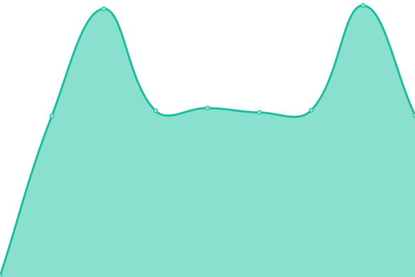

# [📈 Live Status](https://status.opentunnel.net): <!--live status--> **🟧 Partial outage**

This repository contains the open-source uptime monitor and status page for [roosterkid](https://status.opentunnel.net), powered by [Upptime](https://github.com/upptime/upptime).

With [Upptime](https://upptime.js.org), you can get your own unlimited and free uptime monitor and status page, powered entirely by a GitHub repository. We use [Issues](https://github.com/roosterkid/opentunnel-status-server/issues) as incident reports, [Actions](https://github.com/roosterkid/opentunnel-status-server/actions) as uptime monitors, and [Pages](https://status.opentunnel.net) for the status page.

<!--start: status pages-->
<!-- This summary is generated by Upptime (https://github.com/upptime/upptime) -->
<!-- Do not edit this manually, your changes will be overwritten -->
<!-- prettier-ignore -->
| URL | Status | History | Response Time | Uptime |
| --- | ------ | ------- | ------------- | ------ |
|  [OpenTunnel.net Website](https://opentunnel.net/) | 🟩 Up | [open-tunnel-net-website.yml](https://github.com/roosterkid/opentunnel-status-server/commits/HEAD/history/open-tunnel-net-website.yml) | 

 357ms
     
 | 

<a href="https://status.opentunnel.net/history/open-tunnel-net-website">100.00%</a>
    

|  [OpenTunnel.net Community](https://forum.opentunnel.net/) | 🟩 Up | [open-tunnel-net-community.yml](https://github.com/roosterkid/opentunnel-status-server/commits/HEAD/history/open-tunnel-net-community.yml) | 

 541ms
     
 | 

<a href="https://status.opentunnel.net/history/open-tunnel-net-community">100.00%</a>
    

|  [OpenTunnel.net VIP](https://vip.opentunnel.net/) | 🟩 Up | [open-tunnel-net-vip.yml](https://github.com/roosterkid/opentunnel-status-server/commits/HEAD/history/open-tunnel-net-vip.yml) | 

 290ms
     
 | 

<a href="https://status.opentunnel.net/history/open-tunnel-net-vip">100.00%</a>
    

|  [XRAY 🇸🇬 Singapore SGL 1](https://sgx-1.openv2ray.com/) | 🟩 Up | [xray-singapore-sgl-1.yml](https://github.com/roosterkid/opentunnel-status-server/commits/HEAD/history/xray-singapore-sgl-1.yml) | 

 704ms
     
 | 

<a href="https://status.opentunnel.net/history/xray-singapore-sgl-1">100.00%</a>
    

|  [XRAY 🇸🇬 Singapore SGO 1](https://sgx-2.openv2ray.com/) | 🟩 Up | [xray-singapore-sgo-1.yml](https://github.com/roosterkid/opentunnel-status-server/commits/HEAD/history/xray-singapore-sgo-1.yml) | 

 735ms
     
 | 

<a href="https://status.opentunnel.net/history/xray-singapore-sgo-1">100.00%</a>
    

|  [XRAY 🇺🇸 United States USF 1](https://usx-1.openv2ray.com/) | 🟩 Up | [xray-united-states-usf-1.yml](https://github.com/roosterkid/opentunnel-status-server/commits/HEAD/history/xray-united-states-usf-1.yml) | 

 162ms
     
 | 

<a href="https://status.opentunnel.net/history/xray-united-states-usf-1">99.84%</a>
    

|  [XRAY 🇿🇦 South Africa ZAP 1](https://zax-1.openv2ray.com/) | 🟩 Up | [xray-south-africa-zap-1.yml](https://github.com/roosterkid/opentunnel-status-server/commits/HEAD/history/xray-south-africa-zap-1.yml) | 

 802ms
     
 | 

<a href="https://status.opentunnel.net/history/xray-south-africa-zap-1">100.00%</a>
    

|  [XRAY 🇰🇷 South Korea KRP 1](https://krx-1.openv2ray.com/) | 🟩 Up | [xray-south-korea-krp-1.yml](https://github.com/roosterkid/opentunnel-status-server/commits/HEAD/history/xray-south-korea-krp-1.yml) | 

 791ms
     
 | 

<a href="https://status.opentunnel.net/history/xray-south-korea-krp-1">100.00%</a>
    

|  [XRAY 🇳🇱 Netherlands NLI 1](https://nlx-1.openv2ray.com/) | 🟩 Up | [xray-netherlands-nli-1.yml](https://github.com/roosterkid/opentunnel-status-server/commits/HEAD/history/xray-netherlands-nli-1.yml) | 

 330ms
     
 | 

<a href="https://status.opentunnel.net/history/xray-netherlands-nli-1">100.00%</a>
    

|  [XRAY 🇮🇩 Indonesia IDA 1](https://idx-1.openv2ray.com/) | 🟩 Up | [xray-indonesia-ida-1.yml](https://github.com/roosterkid/opentunnel-status-server/commits/HEAD/history/xray-indonesia-ida-1.yml) | 

 708ms
     
 | 

<a href="https://status.opentunnel.net/history/xray-indonesia-ida-1">100.00%</a>
    

|  [XRAY 🇯🇵 Japan JPP 1](https://jpx-1.openv2ray.com/) | 🟩 Up | [xray-japan-jpp-1.yml](https://github.com/roosterkid/opentunnel-status-server/commits/HEAD/history/xray-japan-jpp-1.yml) | 

 469ms
     
 | 

<a href="https://status.opentunnel.net/history/xray-japan-jpp-1">100.00%</a>
    

|  [XRAY 🇧🇷 Brazil BRP 1](https://brx-1.openv2ray.com/) | 🟩 Up | [xray-brazil-brp-1.yml](https://github.com/roosterkid/opentunnel-status-server/commits/HEAD/history/xray-brazil-brp-1.yml) | 

 457ms
     
 | 

<a href="https://status.opentunnel.net/history/xray-brazil-brp-1">81.24%</a>
    

|  [XRAY 🇷🇺 Russia RUL 1](https://rux-1.openv2ray.com/) | 🟩 Up | [xray-russia-rul-1.yml](https://github.com/roosterkid/opentunnel-status-server/commits/HEAD/history/xray-russia-rul-1.yml) | 

 557ms
     
 | 

<a href="https://status.opentunnel.net/history/xray-russia-rul-1">100.00%</a>
    

|  [XRAY 🇸🇬 Singapore SGD 1](https://sgx-3.openv2ray.com/) | 🟩 Up | [xray-singapore-sgd-1.yml](https://github.com/roosterkid/opentunnel-status-server/commits/HEAD/history/xray-singapore-sgd-1.yml) | 

 669ms
     
 | 

<a href="https://status.opentunnel.net/history/xray-singapore-sgd-1">99.83%</a>
    

|  [XRAY 🇮🇳 India IND 1](https://inx-1.openv2ray.com/) | 🟩 Up | [xray-india-ind-1.yml](https://github.com/roosterkid/opentunnel-status-server/commits/HEAD/history/xray-india-ind-1.yml) | 

 681ms
     
 | 

<a href="https://status.opentunnel.net/history/xray-india-ind-1">100.00%</a>
    

|  [XRAY 🇩🇪 Germany DEH 1](https://dex-1.openv2ray.com/) | 🟩 Up | [xray-germany-deh-1.yml](https://github.com/roosterkid/opentunnel-status-server/commits/HEAD/history/xray-germany-deh-1.yml) | 

 330ms
     
 | 

<a href="https://status.opentunnel.net/history/xray-germany-deh-1">100.00%</a>
    

|  [XRAY 🇨🇦 Canada CAO 1](https://cax-1.openv2ray.com/) | 🟩 Up | [xray-canada-cao-1.yml](https://github.com/roosterkid/opentunnel-status-server/commits/HEAD/history/xray-canada-cao-1.yml) | 

 110ms
     
 | 

<a href="https://status.opentunnel.net/history/xray-canada-cao-1">100.00%</a>
    

|  [V2RAY 🇸🇬 Singapore SGL 1](https://sgv-1.openv2ray.com/) | 🟩 Up | [v2-ray-singapore-sgl-1.yml](https://github.com/roosterkid/opentunnel-status-server/commits/HEAD/history/v2-ray-singapore-sgl-1.yml) | 

 662ms
     
 | 

<a href="https://status.opentunnel.net/history/v2-ray-singapore-sgl-1">100.00%</a>
    

|  [V2RAY 🇸🇬 Singapore SGP 1](https://sgv-2.openv2ray.com/) | 🟩 Up | [v2-ray-singapore-sgp-1.yml](https://github.com/roosterkid/opentunnel-status-server/commits/HEAD/history/v2-ray-singapore-sgp-1.yml) | 

 654ms
     
 | 

<a href="https://status.opentunnel.net/history/v2-ray-singapore-sgp-1">99.37%</a>
    

|  [V2RAY 🇮🇩 Indonesia IDA 1](https://idv-1.openv2ray.com/) | 🟩 Up | [v2-ray-indonesia-ida-1.yml](https://github.com/roosterkid/opentunnel-status-server/commits/HEAD/history/v2-ray-indonesia-ida-1.yml) | 

 700ms
     
 | 

<a href="https://status.opentunnel.net/history/v2-ray-indonesia-ida-1">100.00%</a>
    

|  [V2RAY 🇺🇸 United States USF 1](https://usv-1.openv2ray.com/) | 🟩 Up | [v2-ray-united-states-usf-1.yml](https://github.com/roosterkid/opentunnel-status-server/commits/HEAD/history/v2-ray-united-states-usf-1.yml) | 

 106ms
     
 | 

<a href="https://status.opentunnel.net/history/v2-ray-united-states-usf-1">99.64%</a>
    

|  [V2RAY 🇸🇬 Singapore SGD 1](https://sgv-3.openv2ray.com/) | 🟩 Up | [v2-ray-singapore-sgd-1.yml](https://github.com/roosterkid/opentunnel-status-server/commits/HEAD/history/v2-ray-singapore-sgd-1.yml) | 

 649ms
     
 | 

<a href="https://status.opentunnel.net/history/v2-ray-singapore-sgd-1">99.78%</a>
    

|  [V2RAY 🇸🇬 Singapore SGO 1](https://sgv-4.openv2ray.com/) | 🟩 Up | [v2-ray-singapore-sgo-1.yml](https://github.com/roosterkid/opentunnel-status-server/commits/HEAD/history/v2-ray-singapore-sgo-1.yml) | 

 674ms
     
 | 

<a href="https://status.opentunnel.net/history/v2-ray-singapore-sgo-1">100.00%</a>
    

|  [V2RAY 🇻🇳 Vietnam VN 1](https://vnv-1.openv2ray.com/) | 🟥 Down | [v2-ray-vietnam-vn-1.yml](https://github.com/roosterkid/opentunnel-status-server/commits/HEAD/history/v2-ray-vietnam-vn-1.yml) | 

 813ms
     
 | 

<a href="https://status.opentunnel.net/history/v2-ray-vietnam-vn-1">99.73%</a>
    

|  [V2RAY 🇸🇬 Singapore SGV 1](https://sgv-5.openv2ray.com/) | 🟩 Up | [v2-ray-singapore-sgv-1.yml](https://github.com/roosterkid/opentunnel-status-server/commits/HEAD/history/v2-ray-singapore-sgv-1.yml) | 

 664ms
     
 | 

<a href="https://status.opentunnel.net/history/v2-ray-singapore-sgv-1">71.91%</a>
    

|  [V2RAY 🇷🇺 Russia RUL 1](https://ruv-1.openv2ray.com/) | 🟩 Up | [v2-ray-russia-rul-1.yml](https://github.com/roosterkid/opentunnel-status-server/commits/HEAD/history/v2-ray-russia-rul-1.yml) | 

 456ms
     
 | 

<a href="https://status.opentunnel.net/history/v2-ray-russia-rul-1">100.00%</a>
    

|  [V2RAY 🇦🇺 Australia AUL 1](https://auv-1.openv2ray.com/) | 🟩 Up | [v2-ray-australia-aul-1.yml](https://github.com/roosterkid/opentunnel-status-server/commits/HEAD/history/v2-ray-australia-aul-1.yml) | 

 606ms
     
 | 

<a href="https://status.opentunnel.net/history/v2-ray-australia-aul-1">95.09%</a>
    

|  [V2RAY 🇺🇸 United States USF 2](https://usv-2.openv2ray.com/) | 🟩 Up | [v2-ray-united-states-usf-2.yml](https://github.com/roosterkid/opentunnel-status-server/commits/HEAD/history/v2-ray-united-states-usf-2.yml) | 

 108ms
     
 | 

<a href="https://status.opentunnel.net/history/v2-ray-united-states-usf-2">99.61%</a>
    

|  [V2RAY 🇺🇸 United States USF 3](https://usv-3.openv2ray.com/) | 🟩 Up | [v2-ray-united-states-usf-3.yml](https://github.com/roosterkid/opentunnel-status-server/commits/HEAD/history/v2-ray-united-states-usf-3.yml) | 

 86ms
     
 | 

<a href="https://status.opentunnel.net/history/v2-ray-united-states-usf-3">100.00%</a>
    

|  [V2RAY 🇮🇩 Indonesia IDG 1](https://idv-2.openv2ray.com/) | 🟩 Up | [v2-ray-indonesia-idg-1.yml](https://github.com/roosterkid/opentunnel-status-server/commits/HEAD/history/v2-ray-indonesia-idg-1.yml) | 

 714ms
     
 | 

<a href="https://status.opentunnel.net/history/v2-ray-indonesia-idg-1">99.85%</a>
    

|  [V2RAY 🇸🇬 Singapore SGO 2](https://sgv-6.openv2ray.com/) | 🟩 Up | [v2-ray-singapore-sgo-2.yml](https://github.com/roosterkid/opentunnel-status-server/commits/HEAD/history/v2-ray-singapore-sgo-2.yml) | 

 678ms
     
 | 

<a href="https://status.opentunnel.net/history/v2-ray-singapore-sgo-2">100.00%</a>
    

|  [V2RAY 🇳🇱 Netherlands NLB 6](https://nlv-6.openv2ray.com/) | 🟩 Up | [v2-ray-netherlands-nlb-6.yml](https://github.com/roosterkid/opentunnel-status-server/commits/HEAD/history/v2-ray-netherlands-nlb-6.yml) | 

 322ms
     
 | 

<a href="https://status.opentunnel.net/history/v2-ray-netherlands-nlb-6">100.00%</a>
    

|  [V2RAY 🇳🇱 Netherlands NLB 1](https://nlv-1.openv2ray.com/) | 🟩 Up | [v2-ray-netherlands-nlb-1.yml](https://github.com/roosterkid/opentunnel-status-server/commits/HEAD/history/v2-ray-netherlands-nlb-1.yml) | 

 314ms
     
 | 

<a href="https://status.opentunnel.net/history/v2-ray-netherlands-nlb-1">100.00%</a>
    

|  [V2RAY 🇩🇪 Germany DEH 1](https://dev-1.openv2ray.com/) | 🟩 Up | [v2-ray-germany-deh-1.yml](https://github.com/roosterkid/opentunnel-status-server/commits/HEAD/history/v2-ray-germany-deh-1.yml) | 

 351ms
     
 | 

<a href="https://status.opentunnel.net/history/v2-ray-germany-deh-1">100.00%</a>
    

|  [V2RAY 🇩🇪 Germany DEH 2](https://dev-2.openv2ray.com/) | 🟩 Up | [v2-ray-germany-deh-2.yml](https://github.com/roosterkid/opentunnel-status-server/commits/HEAD/history/v2-ray-germany-deh-2.yml) | 

 333ms
     
 | 

<a href="https://status.opentunnel.net/history/v2-ray-germany-deh-2">100.00%</a>
    

|  [V2RAY 🇭🇰 Hong Kong HKM 1](https://hkv-1.openv2ray.com/) | 🟩 Up | [v2-ray-hong-kong-hkm-1.yml](https://github.com/roosterkid/opentunnel-status-server/commits/HEAD/history/v2-ray-hong-kong-hkm-1.yml) | 

 636ms
     
 | 

<a href="https://status.opentunnel.net/history/v2-ray-hong-kong-hkm-1">100.00%</a>
    

|  [V2RAY 🇺🇸 United States USP 4](https://usv-4.openv2ray.com/) | 🟩 Up | [v2-ray-united-states-usp-4.yml](https://github.com/roosterkid/opentunnel-status-server/commits/HEAD/history/v2-ray-united-states-usp-4.yml) | 

 178ms
     
 | 

<a href="https://status.opentunnel.net/history/v2-ray-united-states-usp-4">100.00%</a>
    

|  [V2RAY 🇮🇩 Indonesia IDA 2](https://idv-3.openv2ray.com/) | 🟩 Up | [v2-ray-indonesia-ida-2.yml](https://github.com/roosterkid/opentunnel-status-server/commits/HEAD/history/v2-ray-indonesia-ida-2.yml) | 

 700ms
     
 | 

<a href="https://status.opentunnel.net/history/v2-ray-indonesia-ida-2">100.00%</a>
    

|  [TROJAN 🇸🇬 Singapore SGV 1](https://sgt-1.opensvr.net/) | 🟥 Down | [trojan-singapore-sgv-1.yml](https://github.com/roosterkid/opentunnel-status-server/commits/HEAD/history/trojan-singapore-sgv-1.yml) | 

 1087ms
     
 | 

<a href="https://status.opentunnel.net/history/trojan-singapore-sgv-1">95.80%</a>
    

|  [TROJAN 🇸🇬 Singapore SGP 1](https://sgt-2.opensvr.net/) | 🟩 Up | [trojan-singapore-sgp-1.yml](https://github.com/roosterkid/opentunnel-status-server/commits/HEAD/history/trojan-singapore-sgp-1.yml) | 

 927ms
     
 | 

<a href="https://status.opentunnel.net/history/trojan-singapore-sgp-1">98.65%</a>
    

|  [TROJAN 🇩🇪 Germany DEH 1](https://det-1.opensvr.net/) | 🟩 Up | [trojan-germany-deh-1.yml](https://github.com/roosterkid/opentunnel-status-server/commits/HEAD/history/trojan-germany-deh-1.yml) | 

 360ms
     
 | 

<a href="https://status.opentunnel.net/history/trojan-germany-deh-1">100.00%</a>
    

|  [TROJAN 🇳🇱 Netherlands NLB 1](https://nlt-1.opensvr.net/) | 🟩 Up | [trojan-netherlands-nlb-1.yml](https://github.com/roosterkid/opentunnel-status-server/commits/HEAD/history/trojan-netherlands-nlb-1.yml) | 

 401ms
     
 | 

<a href="https://status.opentunnel.net/history/trojan-netherlands-nlb-1">99.85%</a>
    

|  [TROJAN 🇯🇵 Japan JPP 1](https://jpt-1.opensvr.net/) | 🟩 Up | [trojan-japan-jpp-1.yml](https://github.com/roosterkid/opentunnel-status-server/commits/HEAD/history/trojan-japan-jpp-1.yml) | 

 477ms
     
 | 

<a href="https://status.opentunnel.net/history/trojan-japan-jpp-1">98.75%</a>
    

|  [TROJAN 🇺🇸 United States USF 1](https://ust-1.opensvr.net/) | 🟩 Up | [trojan-united-states-usf-1.yml](https://github.com/roosterkid/opentunnel-status-server/commits/HEAD/history/trojan-united-states-usf-1.yml) | 

 964ms
     
 | 

<a href="https://status.opentunnel.net/history/trojan-united-states-usf-1">99.47%</a>
    

|  [TROJAN 🇸🇬 Singapore SGA 1](https://sgt-3.opensvr.net/) | 🟩 Up | [trojan-singapore-sga-1.yml](https://github.com/roosterkid/opentunnel-status-server/commits/HEAD/history/trojan-singapore-sga-1.yml) | 

 683ms
     
 | 

<a href="https://status.opentunnel.net/history/trojan-singapore-sga-1">100.00%</a>
    

|  [TROJAN 🇮🇩 Indonesia IDJ 1](https://idt-1.opensvr.net/) | 🟩 Up | [trojan-indonesia-idj-1.yml](https://github.com/roosterkid/opentunnel-status-server/commits/HEAD/history/trojan-indonesia-idj-1.yml) | 

 1162ms
     
 | 

<a href="https://status.opentunnel.net/history/trojan-indonesia-idj-1">94.33%</a>
    

|  [SSH 🇸🇬 Singapore SGP 1](http://sgs-4.opensvr.net:8080/) | 🟩 Up | [ssh-singapore-sgp-1.yml](https://github.com/roosterkid/opentunnel-status-server/commits/HEAD/history/ssh-singapore-sgp-1.yml) | 

 443ms
     
 | 

<a href="https://status.opentunnel.net/history/ssh-singapore-sgp-1">99.38%</a>
    

|  [SSH 🇺🇸 United States USF 1](http://uss-1.opensvr.net:8080/) | 🟩 Up | [ssh-united-states-usf-1.yml](https://github.com/roosterkid/opentunnel-status-server/commits/HEAD/history/ssh-united-states-usf-1.yml) | 

 1074ms
     
 | 

<a href="https://status.opentunnel.net/history/ssh-united-states-usf-1">100.00%</a>
    

|  [SSH 🇸🇬 Singapore SGD 2](http://sgs-1.opensvr.net:8080/) | 🟩 Up | [ssh-singapore-sgd-2.yml](https://github.com/roosterkid/opentunnel-status-server/commits/HEAD/history/ssh-singapore-sgd-2.yml) | 

 449ms
     
 | 

<a href="https://status.opentunnel.net/history/ssh-singapore-sgd-2">100.00%</a>
    

|  [SSH 🇩🇪 Germany DEH 1](http://des-1.opensvr.net:8080/) | 🟩 Up | [ssh-germany-deh-1.yml](https://github.com/roosterkid/opentunnel-status-server/commits/HEAD/history/ssh-germany-deh-1.yml) | 

 220ms
     
 | 

<a href="https://status.opentunnel.net/history/ssh-germany-deh-1">100.00%</a>
    

|  [SSH 🇸🇬 Singapore SGP 2](http://sgs-2.opensvr.net:8080/) | 🟩 Up | [ssh-singapore-sgp-2.yml](https://github.com/roosterkid/opentunnel-status-server/commits/HEAD/history/ssh-singapore-sgp-2.yml) | 

 427ms
     
 | 

<a href="https://status.opentunnel.net/history/ssh-singapore-sgp-2">99.17%</a>
    

|  [SSH 🇮🇩 Indonesia IDJ 1](http://ids-1.opensvr.net:8080/) | 🟩 Up | [ssh-indonesia-idj-1.yml](https://github.com/roosterkid/opentunnel-status-server/commits/HEAD/history/ssh-indonesia-idj-1.yml) | 

 550ms
     
 | 

<a href="https://status.opentunnel.net/history/ssh-indonesia-idj-1">99.77%</a>
    

|  [SSH 🇸🇬 Singapore SGL 1](http://sgs-3.opensvr.net:8080/) | 🟩 Up | [ssh-singapore-sgl-1.yml](https://github.com/roosterkid/opentunnel-status-server/commits/HEAD/history/ssh-singapore-sgl-1.yml) | 

 443ms
     
 | 

<a href="https://status.opentunnel.net/history/ssh-singapore-sgl-1">99.81%</a>
    

|  [SSH 🇫🇷 France FRO 1](http://frs-1.opensvr.net:8080/) | 🟩 Up | [ssh-france-fro-1.yml](https://github.com/roosterkid/opentunnel-status-server/commits/HEAD/history/ssh-france-fro-1.yml) | 

 208ms
     
 | 

<a href="https://status.opentunnel.net/history/ssh-france-fro-1">100.00%</a>
    

|  [SSH 🇨🇦 Canada CAO 1](http://cas-1.opensvr.net:8080/) | 🟩 Up | [ssh-canada-cao-1.yml](https://github.com/roosterkid/opentunnel-status-server/commits/HEAD/history/ssh-canada-cao-1.yml) | 

 77ms
     
 | 

<a href="https://status.opentunnel.net/history/ssh-canada-cao-1">99.77%</a>
    

|  [SSH 🇸🇬 Singapore SGD 1](http://sgs-5.opensvr.net:8080/) | 🟩 Up | [ssh-singapore-sgd-1.yml](https://github.com/roosterkid/opentunnel-status-server/commits/HEAD/history/ssh-singapore-sgd-1.yml) | 

 439ms
     
 | 

<a href="https://status.opentunnel.net/history/ssh-singapore-sgd-1">99.81%</a>
    

|  [SSH 🇮🇩 Indonesia IDA 1](http://ids-2.opensvr.net:8080/) | 🟩 Up | [ssh-indonesia-ida-1.yml](https://github.com/roosterkid/opentunnel-status-server/commits/HEAD/history/ssh-indonesia-ida-1.yml) | 

 472ms
     
 | 

<a href="https://status.opentunnel.net/history/ssh-indonesia-ida-1">97.87%</a>
    

|  [SSH 🇮🇳 India IND 1](http://ins-1.opensvr.net:8080/) | 🟩 Up | [ssh-india-ind-1.yml](https://github.com/roosterkid/opentunnel-status-server/commits/HEAD/history/ssh-india-ind-1.yml) | 

 439ms
     
 | 

<a href="https://status.opentunnel.net/history/ssh-india-ind-1">100.00%</a>
    

|  [SSH 🇺🇸 United States USF 2](http://uss-2.opensvr.net:8080/) | 🟩 Up | [ssh-united-states-usf-2.yml](https://github.com/roosterkid/opentunnel-status-server/commits/HEAD/history/ssh-united-states-usf-2.yml) | 

 53ms
     
 | 

<a href="https://status.opentunnel.net/history/ssh-united-states-usf-2">100.00%</a>
    

|  [SSH 🇩🇪 Germany DEH 2](http://des-2.opensvr.net:8080/) | 🟩 Up | [ssh-germany-deh-2.yml](https://github.com/roosterkid/opentunnel-status-server/commits/HEAD/history/ssh-germany-deh-2.yml) | 

 3235ms
     
 | 

<a href="https://status.opentunnel.net/history/ssh-germany-deh-2">100.00%</a>
    

|  [SSH 🇫🇷 France FRO 2](http://frs-2.opensvr.net:8080/) | 🟩 Up | [ssh-france-fro-2.yml](https://github.com/roosterkid/opentunnel-status-server/commits/HEAD/history/ssh-france-fro-2.yml) | 

 209ms
     
 | 

<a href="https://status.opentunnel.net/history/ssh-france-fro-2">100.00%</a>
    

|  [SSH 🇮🇩 Indonesia IDN 1](http://ids-3.opensvr.net:8080/) | 🟩 Up | [ssh-indonesia-idn-1.yml](https://github.com/roosterkid/opentunnel-status-server/commits/HEAD/history/ssh-indonesia-idn-1.yml) | 

 457ms
     
 | 

<a href="https://status.opentunnel.net/history/ssh-indonesia-idn-1">99.66%</a>
    

|  [SSH 🇧🇬 Bulgaria BGI 1](http://bgs-1.opensvr.net:8080/) | 🟩 Up | [ssh-bulgaria-bgi-1.yml](https://github.com/roosterkid/opentunnel-status-server/commits/HEAD/history/ssh-bulgaria-bgi-1.yml) | 

 255ms
     
 | 

<a href="https://status.opentunnel.net/history/ssh-bulgaria-bgi-1">99.81%</a>
    

|  [SSH 🇺🇦 Ukraine UAI 1](http://uas-1.opensvr.net:8080/) | 🟩 Up | [ssh-ukraine-uai-1.yml](https://github.com/roosterkid/opentunnel-status-server/commits/HEAD/history/ssh-ukraine-uai-1.yml) | 

 255ms
     
 | 

<a href="https://status.opentunnel.net/history/ssh-ukraine-uai-1">99.32%</a>
    

|  [SSH 🇮🇩 Indonesia IDA 2](http://ids-4.opensvr.net:8080/) | 🟥 Down | [ssh-indonesia-ida-2.yml](https://github.com/roosterkid/opentunnel-status-server/commits/HEAD/history/ssh-indonesia-ida-2.yml) | 

 473ms
     
 | 

<a href="https://status.opentunnel.net/history/ssh-indonesia-ida-2">93.51%</a>
    

|  [SSH 🇺🇸 United States USD 1](http://uss-3.opensvr.net:8080/) | 🟩 Up | [ssh-united-states-usd-1.yml](https://github.com/roosterkid/opentunnel-status-server/commits/HEAD/history/ssh-united-states-usd-1.yml) | 

 57ms
     
 | 

<a href="https://status.opentunnel.net/history/ssh-united-states-usd-1">100.00%</a>
    

|  [SSH 🇱🇺 Luxembourg LUF 1](http://lus-1.opensvr.net:8080/) | 🟩 Up | [ssh-luxembourg-luf-1.yml](https://github.com/roosterkid/opentunnel-status-server/commits/HEAD/history/ssh-luxembourg-luf-1.yml) | 

 237ms
     
 | 

<a href="https://status.opentunnel.net/history/ssh-luxembourg-luf-1">90.17%</a>
    

|  [SSH 🇬🇧 United Kingdom UKD 1](http://uks-1.opensvr.net:8080/) | 🟩 Up | [ssh-united-kingdom-ukd-1.yml](https://github.com/roosterkid/opentunnel-status-server/commits/HEAD/history/ssh-united-kingdom-ukd-1.yml) | 

 191ms
     
 | 

<a href="https://status.opentunnel.net/history/ssh-united-kingdom-ukd-1">99.84%</a>
    

|  [SSH 🇨🇦 Canada CAO 2](http://cas-2.opensvr.net:8080/) | 🟩 Up | [ssh-canada-cao-2.yml](https://github.com/roosterkid/opentunnel-status-server/commits/HEAD/history/ssh-canada-cao-2.yml) | 

 72ms
     
 | 

<a href="https://status.opentunnel.net/history/ssh-canada-cao-2">100.00%</a>
    

|  [SSH 🇯🇵 Japan JAP 1](http://jas-1.opensvr.net:8080/) | 🟩 Up | [ssh-japan-jap-1.yml](https://github.com/roosterkid/opentunnel-status-server/commits/HEAD/history/ssh-japan-jap-1.yml) | 

 310ms
     
 | 

<a href="https://status.opentunnel.net/history/ssh-japan-jap-1">99.81%</a>
    

|  [SSH 🇸🇬 Singapore XSG 1](http://xs-1.opensvr.net:8080/) | 🟩 Up | [ssh-singapore-xsg-1.yml](https://github.com/roosterkid/opentunnel-status-server/commits/HEAD/history/ssh-singapore-xsg-1.yml) | 

 438ms
     
 | 

<a href="https://status.opentunnel.net/history/ssh-singapore-xsg-1">100.00%</a>
    

|  [SSH 🇸🇬 Singapore XSG 2](http://xs-2.opensvr.net:8080/) | 🟩 Up | [ssh-singapore-xsg-2.yml](https://github.com/roosterkid/opentunnel-status-server/commits/HEAD/history/ssh-singapore-xsg-2.yml) | 

 442ms
     
 | 

<a href="https://status.opentunnel.net/history/ssh-singapore-xsg-2">100.00%</a>
    

|  [SSH 🇨🇭 Switzerland CHI 1](http://chs-1.opensvr.net:8080/) | 🟩 Up | [ssh-switzerland-chi-1.yml](https://github.com/roosterkid/opentunnel-status-server/commits/HEAD/history/ssh-switzerland-chi-1.yml) | 

 266ms
     
 | 

<a href="https://status.opentunnel.net/history/ssh-switzerland-chi-1">100.00%</a>
    

|  [PPTP 🇸🇬 Singapore SGD 1](http://sgp-1.opensvr.net/) | 🟩 Up | [pptp-singapore-sgd-1.yml](https://github.com/roosterkid/opentunnel-status-server/commits/HEAD/history/pptp-singapore-sgd-1.yml) | 

 442ms
     
 | 

<a href="https://status.opentunnel.net/history/pptp-singapore-sgd-1">100.00%</a>
    

|  [PPTP 🇺🇸 United States USF 1](http://usp-1.opensvr.net/) | 🟩 Up | [pptp-united-states-usf-1.yml](https://github.com/roosterkid/opentunnel-status-server/commits/HEAD/history/pptp-united-states-usf-1.yml) | 

 194ms
     
 | 

<a href="https://status.opentunnel.net/history/pptp-united-states-usf-1">100.00%</a>
    

|  [PPTP 🇫🇷 France FRT 1](http://frp-1.opensvr.net/) | 🟩 Up | [pptp-france-frt-1.yml](https://github.com/roosterkid/opentunnel-status-server/commits/HEAD/history/pptp-france-frt-1.yml) | 

 206ms
     
 | 

<a href="https://status.opentunnel.net/history/pptp-france-frt-1">100.00%</a>
    

|  [PPTP 🇮🇩 Indonesia IDJ 1](http://idp-2.opensvr.net/) | 🟩 Up | [pptp-indonesia-idj-1.yml](https://github.com/roosterkid/opentunnel-status-server/commits/HEAD/history/pptp-indonesia-idj-1.yml) | 

 462ms
     
 | 

<a href="https://status.opentunnel.net/history/pptp-indonesia-idj-1">100.00%</a>
    

|  [OVPN 🇸🇬 Singapore SGP 1](http://sgo-1.opensvr.net:8080/) | 🟩 Up | [ovpn-singapore-sgp-1.yml](https://github.com/roosterkid/opentunnel-status-server/commits/HEAD/history/ovpn-singapore-sgp-1.yml) | 

 440ms
     
 | 

<a href="https://status.opentunnel.net/history/ovpn-singapore-sgp-1">100.00%</a>
    

|  [OVPN 🇺🇸 United States USF 1](http://uso-1.opensvr.net:8080/) | 🟩 Up | [ovpn-united-states-usf-1.yml](https://github.com/roosterkid/opentunnel-status-server/commits/HEAD/history/ovpn-united-states-usf-1.yml) | 

 192ms
     
 | 

<a href="https://status.opentunnel.net/history/ovpn-united-states-usf-1">100.00%</a>
    

|  [OVPN 🇸🇬 Singapore SGD 1](http://sgo-2.opensvr.net:8080/) | 🟩 Up | [ovpn-singapore-sgd-1.yml](https://github.com/roosterkid/opentunnel-status-server/commits/HEAD/history/ovpn-singapore-sgd-1.yml) | 

 438ms
     
 | 

<a href="https://status.opentunnel.net/history/ovpn-singapore-sgd-1">100.00%</a>
    

|  [OVPN 🇩🇪 Germany DEH 1](http://deo-1.opensvr.net:8080/) | 🟩 Up | [ovpn-germany-deh-1.yml](https://github.com/roosterkid/opentunnel-status-server/commits/HEAD/history/ovpn-germany-deh-1.yml) | 

 212ms
     
 | 

<a href="https://status.opentunnel.net/history/ovpn-germany-deh-1">100.00%</a>
    

|  [OVPN 🇫🇷 France FRO 1](http://fro-1.opensvr.net:8080/) | 🟩 Up | [ovpn-france-fro-1.yml](https://github.com/roosterkid/opentunnel-status-server/commits/HEAD/history/ovpn-france-fro-1.yml) | 

 209ms
     
 | 

<a href="https://status.opentunnel.net/history/ovpn-france-fro-1">100.00%</a>
    

|  [OVPN 🇺🇸 United States USQ 1](http://uso-2.opensvr.net:8080/) | 🟩 Up | [ovpn-united-states-usq-1.yml](https://github.com/roosterkid/opentunnel-status-server/commits/HEAD/history/ovpn-united-states-usq-1.yml) | 

 77ms
     
 | 

<a href="https://status.opentunnel.net/history/ovpn-united-states-usq-1">100.00%</a>
    

|  [OVPN 🇸🇬 Singapore SGD 2](http://sgo-3.opensvr.net:8080/) | 🟩 Up | [ovpn-singapore-sgd-2.yml](https://github.com/roosterkid/opentunnel-status-server/commits/HEAD/history/ovpn-singapore-sgd-2.yml) | 

 440ms
     
 | 

<a href="https://status.opentunnel.net/history/ovpn-singapore-sgd-2">100.00%</a>
    

|  [OVPN 🇮🇩 Indonesia IDJ 1](http://ido-1.opensvr.net:8080/) | 🟩 Up | [ovpn-indonesia-idj-1.yml](https://github.com/roosterkid/opentunnel-status-server/commits/HEAD/history/ovpn-indonesia-idj-1.yml) | 

 475ms
     
 | 

<a href="https://status.opentunnel.net/history/ovpn-indonesia-idj-1">100.00%</a>
    

|  [OVPN 🇹🇷 Turkey TRC 1](http://tro-1.opensvr.net:8080/) | 🟩 Up | [ovpn-turkey-trc-1.yml](https://github.com/roosterkid/opentunnel-status-server/commits/HEAD/history/ovpn-turkey-trc-1.yml) | 

 276ms
     
 | 

<a href="https://status.opentunnel.net/history/ovpn-turkey-trc-1">100.00%</a>
    

<!--end: status pages-->

[**Visit our status website →**](https://status.opentunnel.net)

## 📄 License

- Powered by: [Upptime](https://github.com/upptime/upptime)
- Code: [MIT](./LICENSE) © [roosterkid](https://status.opentunnel.net)
- Data in the `./history` directory: [Open Database License](https://opendatacommons.org/licenses/odbl/1-0/)
